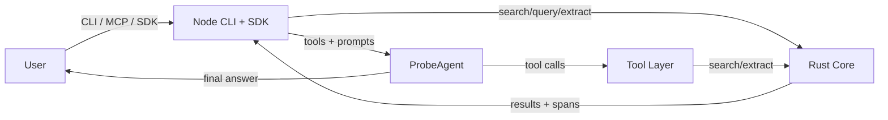

# Probe Architecture

This document explains how Probe is structured and how data flows between components.

## Purpose
Probe provides fast, local, AI-friendly code search and extraction. The system is split into:
- a Rust core that does search + extraction,
- a Node.js SDK/CLI layer that drives AI workflows and tool orchestration.

## Repository Map (high level)
```
src/                 Rust core (search, extract, ranking)
npm/                 Node.js SDK + CLI (ProbeAgent, tools, MCP server)
examples/chat/        probe-chat (interactive chat + web UI)
examples/reranker/    Optional reranking examples
```

## Core Components

### 1) Rust Core (`src/`)
Responsibilities:
- Query parsing, tokenization, and scoring (BM25/TF-IDF/hybrid).
- Fast file scanning (ripgrep) and language-aware extraction (tree-sitter).
- CLI entrypoints: `src/main.rs`, `src/cli.rs`.

Key files to read:
- `src/main.rs`: binary entrypoint.
- `src/cli.rs`: CLI args and command routing.
- `src/search/`: search pipeline, query execution, and scoring.
- `src/query.rs` / `src/query_validator.rs`: query parsing and validation.
- `src/extract/`: tree-sitter powered extraction.
- `src/ranking.rs` / `src/simd_ranking.rs`: ranking implementations and optimizations.
- `src/models.rs`: data models returned by search/extract.

### 2) Node SDK + CLI (`npm/`)
Responsibilities:
- `ProbeAgent` builds prompts, manages tool loops, retries, fallbacks, and context.
- Tool wrappers for search/extract/query/listFiles/searchFiles and delegate subagents.
- MCP server (`npm/src/agent/index.js`) exposes `search_code` and `extract_code`.

Key files to read:
- `npm/src/agent/ProbeAgent.js`: core AI agent loop and prompt construction.
- `npm/src/agent/tools.js`: tool definitions + XML format parsing.
- `npm/src/tools/vercel.js`: search/extract/query implementations and delegate tool wiring.
- `npm/src/agent/index.js`: CLI/MCP server entrypoint for ProbeAgent.
- `npm/src/utils/file-lister.js`: repo structure listing for prompts.
- `npm/src/delegate.js`: subagent orchestration.

### 3) probe-chat (`examples/chat/`)
Responsibilities:
- End-user chat interface (CLI + optional web UI).
- Wraps `ProbeAgent` and passes allowed folders + prompt configuration.

Key files to read:
- `examples/chat/index.js`: CLI entrypoint for probe-chat.
- `examples/chat/probeChat.js`: ProbeAgent wrapper and session handling.
- `examples/chat/webServer.js`: web UI server.

### 4) Reranking (optional)
Responsibilities:
- Transformer-based reranking utilities and demos (`examples/reranker/`, `src/bert_reranker.rs`).

Key files to read:
- `src/bert_reranker.rs`: core reranker implementation.
- `examples/reranker/`: benchmarks and example usage.

## Data Flow: Search / Extract
1) User calls `probe search` or a tool that triggers search.
2) CLI routes to Rust core (`src/cli.rs` → `src/search/`).
3) Rust core scans files and ranks results (`src/search/`, `src/ranking.rs`).
4) Results include file paths and line/symbol targets (`src/models.rs`).
5) `probe extract` returns full code blocks via tree-sitter (`src/extract/`).

## Data Flow: AI / ProbeAgent
1) ProbeAgent builds system prompt (persona + tools + repo structure + architecture doc).
   - Prompt construction: `npm/src/agent/ProbeAgent.js` (getSystemMessage).
2) Agent uses tools (search/query/extract/listFiles) to gather evidence.
   - Tool definitions: `npm/src/agent/tools.js`
   - Tool execution: `npm/src/tools/vercel.js`
3) Final response is produced with retries/fallbacks and optional JSON/mermaid validation.
   - Retry/fallback: `npm/src/agent/RetryManager.js`, `npm/src/agent/FallbackManager.js`
   - Validation: `npm/src/agent/schemaUtils.js`

## System Diagram


## Security Boundaries
- File access is restricted to `allowedFolders` (workspace root(s)).
- Tools validate paths to avoid traversal outside allowed folders.

## Extension Points
- Add language support by updating tree-sitter configs and extraction rules.
- Add new tools via MCP or native tool definitions.

## Where to Start (for new contributors)
1) `src/cli.rs` and `src/search/` to understand the Rust search pipeline.
2) `npm/src/agent/ProbeAgent.js` to understand AI prompt + tool orchestration.
3) `npm/src/tools/vercel.js` to see how search/extract/query are executed.
4) `examples/chat/index.js` to see end-user usage.
