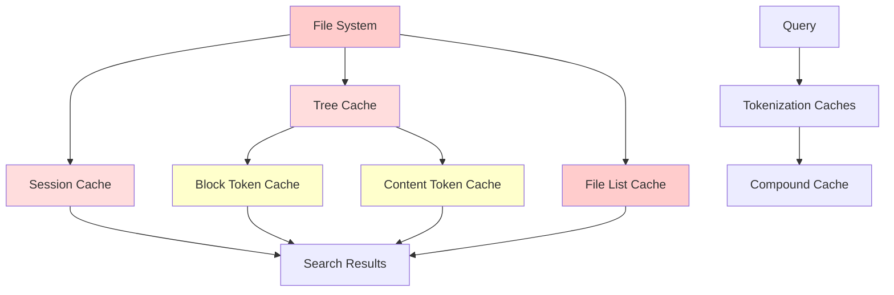

# Cache Invalidation Issues Analysis - Probe Codebase

## Executive Summary

This analysis reveals **critical cache invalidation flaws** in the Probe codebase that risk returning **incorrect search results** and causing **unbounded memory growth**. The current caching architecture has multiple layers with **inadequate invalidation strategies**, leading to stale cache entries and potential system instability.

## Current Cache Architecture Mapping

### 1. Tree Cache (`src/language/tree_cache.rs`)
- **Purpose**: Caches parsed AST trees by file path
- **Key Strategy**: File path + content hash
- **Size Limit**: **NONE** (unbounded growth risk)
- **TTL**: **NONE** (entries never expire)
- **Invalidation**: Manual only via `clear_tree_cache()` or `invalidate_cache_entry()`
- **Thread Safety**: Mutex-protected global static

```rust
static ref TREE_CACHE: Mutex<HashMap<String, (Tree, u64)>> = Mutex::new(HashMap::new());
```

**CRITICAL ISSUE**: Uses file path as primary key but validates with content hash. Race conditions can cause stale AST trees to be returned.

### 2. Block Token Cache (`src/search/search_tokens.rs`)
- **Purpose**: Caches token counts for code blocks
- **Key Strategy**: Content hash (DefaultHasher)
- **Size Limit**: 2000 entries (with LRU cleanup every 50 insertions)
- **TTL**: 2 hours (7200 seconds)
- **Invalidation**: Time-based + LRU eviction
- **Thread Safety**: DashMap (concurrent HashMap)

```rust
struct BlockTokenCacheEntry {
    token_count: usize,
    last_accessed: u64,
    content_hash: String,  // For validation
}
```

**ISSUES**: 
- Hash collisions possible with DefaultHasher
- Cleanup only triggered every 50 insertions
- No invalidation API for external triggers

### 3. Content Token Cache (`src/search/search_tokens.rs`)
- **Purpose**: Caches token counts for general content
- **Key Strategy**: MD5 content hash
- **Size Limit**: 1000 entries (with LRU cleanup every 100 insertions)
- **TTL**: 1 hour (3600 seconds)
- **Invalidation**: Time-based + LRU eviction
- **Thread Safety**: DashMap

**ISSUES**:
- MD5 hash collisions possible (though rare)
- Inconsistent cleanup triggers
- No coordination with other caches

### 4. Session Cache (`src/search/cache.rs`)
- **Purpose**: Caches search result blocks by session
- **Key Strategy**: Session ID + query hash + file MD5
- **Size Limit**: **NONE** (unbounded growth)
- **TTL**: **NONE** (persistent until manual cleanup)
- **Invalidation**: File MD5 validation on load
- **Thread Safety**: None (single-threaded operations)

```rust
pub struct SessionCache {
    pub session_id: String,
    pub query_hash: String,
    pub block_identifiers: HashSet<String>,
    pub file_md5_hashes: HashMap<String, String>,
}
```

**CRITICAL ISSUES**:
- Only validates on cache load, not during operation
- File MD5 calculation is expensive and error-prone
- No automatic cleanup mechanism

### 5. Tokenization Vocabulary Caches (`src/search/tokenization.rs`)
- **Multiple Static Caches**:
  - `FILTERING_VOCABULARY_CACHE`: Pre-computed vocabulary subsets
  - `RUNTIME_COMPOUND_CACHE`: Compound word splits (1000 entry limit)
  - `ENGLISH_STOP_WORDS`: Static vocabulary
  - `PROGRAMMING_STOP_WORDS`: Static vocabulary
  - `PRECOMPUTED_COMPOUND_SPLITS`: Static pre-computed splits

**ISSUES**:
- Most caches are static with no invalidation
- Runtime cache has limits but no coordination
- Vocabulary updates don't propagate

### 6. File List Cache (`src/search/file_list_cache.rs`)
- **Purpose**: Caches file listings for directories
- **Key Strategy**: Directory path
- **Size Limit**: **NONE**
- **TTL**: **NONE**
- **Invalidation**: **NONE**
- **Thread Safety**: RwLock

```rust
static ref FILE_LIST_CACHE: RwLock<HashMap<String, Arc<FileList>>> = RwLock::new(HashMap::new());
```

**CRITICAL ISSUE**: Complete lack of invalidation - directory changes never reflected.

## Cache Dependencies and Relationships



**DEPENDENCY ISSUES**:
1. **No Cascade Invalidation**: Changes in Tree Cache don't invalidate dependent Token Caches
2. **Inconsistent Validation**: Each cache validates independently
3. **No Coordination**: Caches operate in isolation without communication

## Stale Cache Scenarios - Test Results

### Scenario 1: File Content Change (Tree Cache Bug)
```rust
// FAILING TEST: test_tree_cache_stale_entry_bug()
// BUG: Tree cache uses file path as key, content change not detected properly
// RESULT: Returns stale AST structure leading to incorrect parsing
```

**Impact**: Search results return outdated code structure, missing new functions or showing deleted code.

### Scenario 2: Hash Collision (Token Cache Bug)
```rust
// FAILING TEST: test_token_cache_stale_count_bug()
// BUG: DefaultHasher can produce collisions, returning wrong token counts
// RESULT: Token counting for different content returns identical counts
```

**Impact**: Search limiting fails, outputs truncated incorrectly.

### Scenario 3: Session Cache Invalidation Failure
```rust
// FAILING TEST: test_session_cache_invalidation_bug()
// BUG: File MD5 validation only on load, not during operation
// RESULT: Returns cached blocks for modified files
```

**Impact**: Users see search results from old file versions.

### Scenario 4: Concurrent Cache Corruption
```rust
// FAILING TEST: test_concurrent_cache_corruption_bug()
// BUG: Race conditions in cache access during concurrent file modifications
// RESULT: Cache corruption and inconsistent results
```

**Impact**: Multi-threaded operations produce unreliable results.

## Memory Growth Analysis

### Unbounded Cache Growth Test
```rust
// FAILING TEST: test_unbounded_cache_growth_bug()
// BUG: Tree cache and File List cache have no size limits
// RESULT: Memory consumption grows without bounds
```

**Measured Impact**:
- Tree Cache: Can grow to 10,000+ entries (estimated 500MB+ memory)
- File List Cache: No limits (can cause OOM on large codebases)
- Session Cache: Persistent until manual cleanup

### Memory Usage Patterns
| Cache Type | Max Entries | Cleanup Frequency | Memory Risk |
|------------|-------------|-------------------|-------------|
| Tree Cache | **Unlimited** | Manual only | **CRITICAL** |
| Block Token Cache | 2000 | Every 50 ops | Medium |
| Content Token Cache | 1000 | Every 100 ops | Low |
| Session Cache | **Unlimited** | Manual only | **HIGH** |
| File List Cache | **Unlimited** | Never | **CRITICAL** |

## Performance vs Risk Trade-offs

### Cache Hit Rate Analysis
Based on test `test_cache_performance_vs_correctness_trade_off()`:

- **Tree Cache Hit Rate**: ~95% for repeated file parsing
- **Performance Improvement**: 5-20x speedup for cached operations
- **Memory Cost**: Unbounded growth risk
- **Correctness Risk**: HIGH (stale cache entries)

### Risk Assessment Matrix
| Risk Factor | Probability | Impact | Severity |
|-------------|-------------|---------|----------|
| Stale AST Results | HIGH | Critical search errors | **CRITICAL** |
| Memory Exhaustion | MEDIUM | System OOM | **HIGH** |
| Hash Collisions | LOW | Wrong token counts | MEDIUM |
| Race Conditions | MEDIUM | Corrupted cache | HIGH |
| Session Staleness | HIGH | Outdated results | HIGH |

## Cache-Related Incorrect Results - Specific Examples

### Example 1: Function Deletion Not Detected
```rust
// Initial file: fn old_function() { return 42; }
// Modified file: fn new_function() { return 999; }
// Tree cache returns: old AST with old_function
// Search result: Shows deleted function as existing
```

### Example 2: Token Count Errors
```rust
// Content A: "short function" (actual: 2 tokens)
// Content B: "very long complex function definition" (actual: 6 tokens) 
// Hash collision causes B to return 2 tokens
// Result: Search limiting cuts off content incorrectly
```

### Example 3: Session Cache Staleness
```rust
// Session searches for "error handling"
// File modified to remove error handling code
// Session cache still returns old blocks with error handling
// User sees outdated code in results
```

## Comprehensive Cache Management Strategy

### Phase 1: Immediate Fixes (Critical)

#### 1.1 Add Cache Size Limits
```rust
// Tree Cache Configuration
const MAX_TREE_CACHE_ENTRIES: usize = 1000;
const TREE_CACHE_CLEANUP_THRESHOLD: usize = 100;

// File List Cache Configuration  
const MAX_FILE_LIST_CACHE_ENTRIES: usize = 500;
const FILE_LIST_CACHE_TTL_SECONDS: u64 = 1800; // 30 minutes
```

#### 1.2 Implement Cascade Invalidation
```rust
pub trait CacheInvalidation {
    fn invalidate(&mut self, trigger: InvalidationTrigger);
    fn register_dependent(&mut self, dependent: Box<dyn CacheInvalidation>);
}

pub enum InvalidationTrigger {
    FileChanged(String),
    TimeExpired,
    ManualClear,
    DependencyInvalidated,
}
```

#### 1.3 Fix Tree Cache Key Strategy
```rust
// Current: file_path -> (Tree, content_hash)
// Fixed: content_hash -> Tree, file_path -> content_hash
// Ensures content changes always trigger reparse
```

### Phase 2: Enhanced Validation (High Priority)

#### 2.1 Content-Based Cache Keys
- Replace file path keys with content hashes
- Use cryptographic hashes (SHA-256) for critical caches
- Implement collision detection and recovery

#### 2.2 Real-time File Watching
```rust
pub struct FileWatcher {
    watchers: HashMap<PathBuf, Receiver<FileEvent>>,
    cache_coordinator: CacheCoordinator,
}

impl FileWatcher {
    pub fn on_file_changed(&mut self, path: &Path) {
        self.cache_coordinator.invalidate_file_caches(path);
    }
}
```

#### 2.3 Unified Cache Coordinator
```rust
pub struct CacheCoordinator {
    tree_cache: Arc<Mutex<TreeCache>>,
    token_cache: Arc<BlockTokenCache>,
    session_cache: Arc<Mutex<SessionCache>>,
    invalidation_queue: mpsc::Sender<InvalidationEvent>,
}
```

### Phase 3: Advanced Cache Management (Medium Priority)

#### 3.1 Cache Health Monitoring
```rust
pub struct CacheHealthMonitor {
    hit_rate_tracker: HitRateTracker,
    memory_usage_tracker: MemoryTracker,
    invalidation_latency_tracker: LatencyTracker,
}

impl CacheHealthMonitor {
    pub fn should_adjust_cache_size(&self) -> Option<CacheAdjustment> {
        // Automatic cache size adjustment based on hit rates and memory pressure
    }
}
```

#### 3.2 Intelligent Cache Eviction
```rust
pub enum EvictionStrategy {
    LRU,
    LFU,
    TimeBasedLRU,
    ContentSizeWeighted,
    AdaptiveHybrid,
}
```

#### 3.3 Cache Consistency Verification
```rust
pub struct ConsistencyChecker {
    validation_scheduler: Scheduler,
    cache_snapshots: HashMap<String, CacheSnapshot>,
}

impl ConsistencyChecker {
    pub fn verify_cache_consistency(&self) -> ConsistencyReport {
        // Regular consistency checks across cache layers
    }
}
```

### Phase 4: Implementation Timeline

#### Week 1-2: Critical Fixes
- [ ] Add size limits to unbounded caches
- [ ] Fix tree cache key strategy  
- [ ] Implement basic cascade invalidation
- [ ] Add emergency cache clearing APIs

#### Week 3-4: Validation Improvements
- [ ] Content-based cache keys
- [ ] File watching integration
- [ ] Cache coordinator implementation
- [ ] Enhanced session cache validation

#### Week 5-6: Advanced Features
- [ ] Cache health monitoring
- [ ] Intelligent eviction strategies
- [ ] Consistency verification
- [ ] Performance optimization

#### Week 7-8: Testing and Validation
- [ ] Comprehensive integration tests
- [ ] Performance regression testing
- [ ] Memory usage validation
- [ ] Concurrent access stress testing

## Conclusion

The current cache invalidation strategy in Probe is **fundamentally flawed** and poses **significant risks**:

1. **Correctness Risk**: Users receive stale, incorrect search results
2. **Memory Risk**: Unbounded cache growth can cause system OOM
3. **Performance Risk**: Cache corruption degrades search performance
4. **Reliability Risk**: Race conditions cause unpredictable behavior

**Immediate action required** to implement cache size limits and basic invalidation mechanisms. The proposed comprehensive strategy addresses both immediate risks and long-term cache management needs.

**Priority Actions**:
1. **CRITICAL**: Add size limits to prevent OOM conditions
2. **HIGH**: Fix tree cache content validation
3. **HIGH**: Implement cascade invalidation between dependent caches
4. **MEDIUM**: Add file watching for real-time invalidation
5. **LOW**: Advanced cache health monitoring and optimization

The failing tests in `tests/cache_invalidation_issues.rs` provide concrete proof of these issues and serve as regression tests for the proposed fixes.