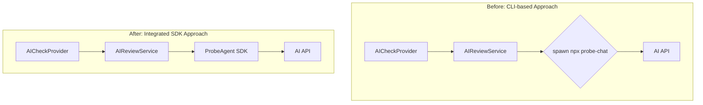
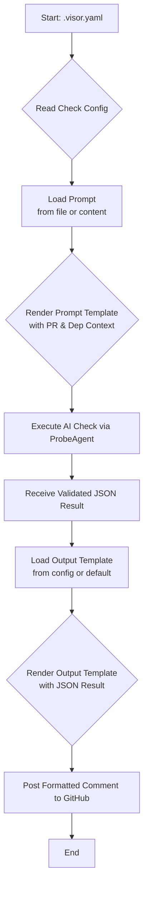
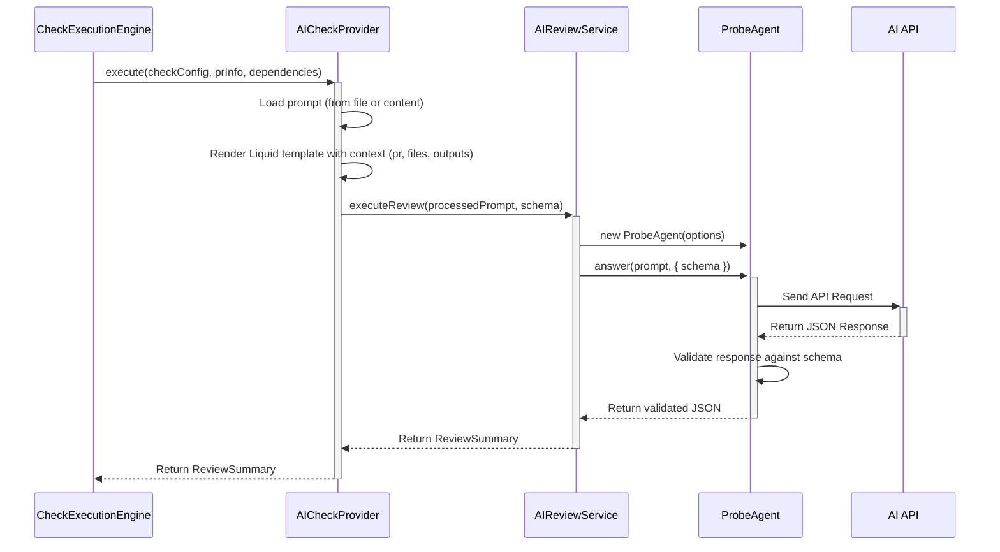
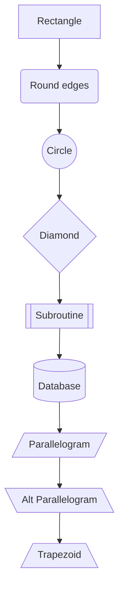
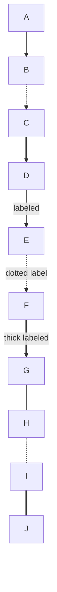
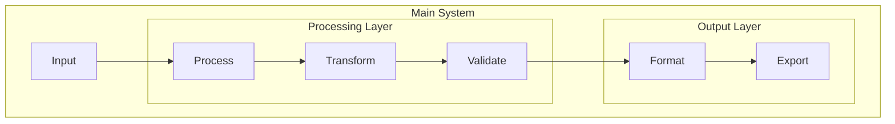
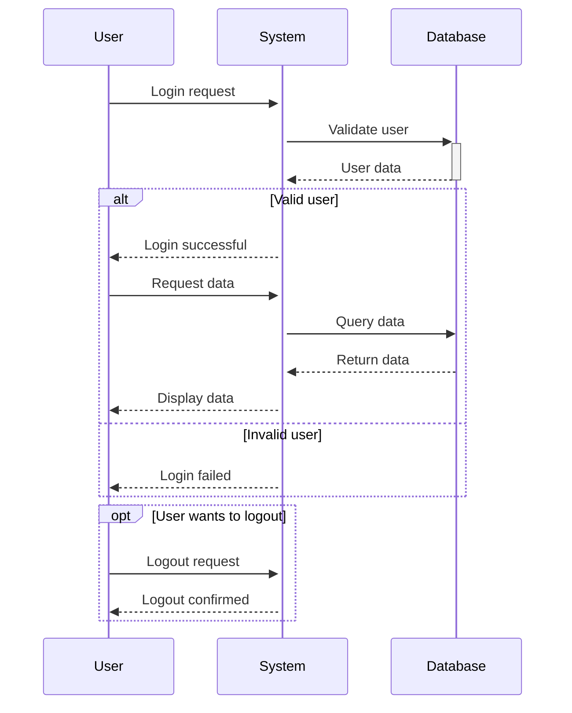
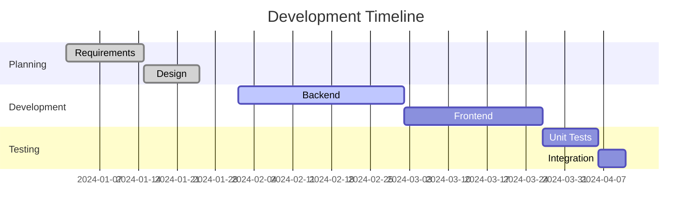
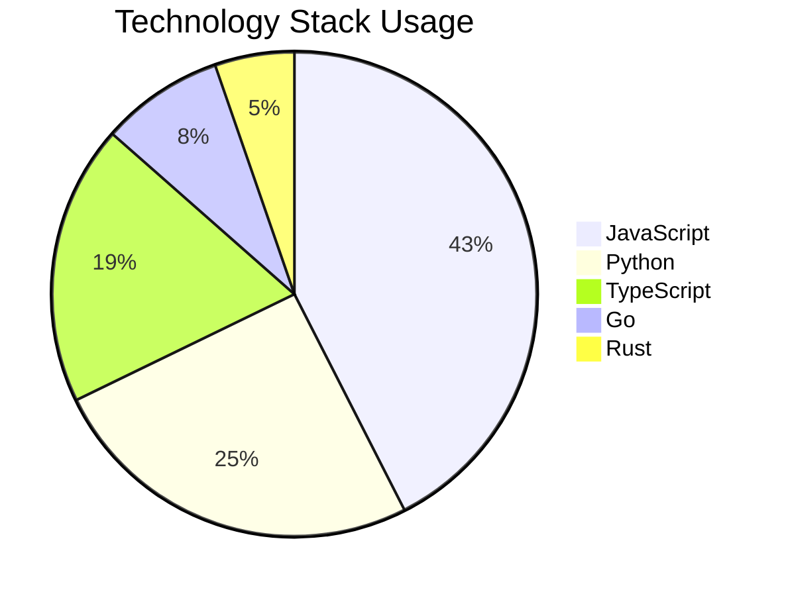
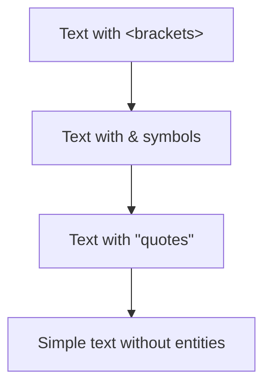

# GitHub Mermaid Compatibility Test

This document contains mermaid diagrams validated by our GitHub-strict validator. All diagrams should render correctly on GitHub.

## ✅ Fixed Versions of Originally Problematic Diagrams

### 1. Component Interaction Diagram (Fixed)

**Original Issue:** Single quotes in `{spawn('npx probe-chat')}` caused "got 'PS'" error  
**Fix Applied:** Removed single quotes, used simple text

### 2. Data Flow Chart (Fixed)

**Original Issue:** Parentheses in `[Load Prompt (file or content)]` caused "got 'PS'" error  
**Fix Applied:** Used double quotes and descriptive text instead of parentheses

### 3. AI Check Sequence (Already Compatible)

**Status:** No changes needed - this already worked on GitHub

## 🧪 Additional Compatibility Tests

### Node Shapes Test

Testing all supported node shapes:

### Arrow Types Test

Testing different arrow types and labels:

### Subgraph Test

Testing nested subgraphs:

### Complex Sequence Test

Testing complex sequence with alt/opt blocks:

### Gantt Chart Test

### Pie Chart Test

### HTML Entity Escaping Test

## 📊 Validation Results

✅ **All diagrams above have passed our GitHub-strict validator**  
✅ **Fixed the "got 'PS'" errors from original diagrams**  
✅ **Should render correctly on GitHub**  

## 🔍 Key GitHub Compatibility Rules Discovered

1. **❌ Avoid single quotes in node labels**: `{spawn('cmd')}` → Use `{spawn cmd}`
2. **❌ Avoid parentheses in square brackets**: `[Text (details)]` → Use `["Text details"]` 
3. **✅ Use double quotes for complex text**: `["Text with (special) chars"]`
4. **✅ HTML entities work**: `&lt;`, `&amp;`, `&quot;`
5. **✅ Line breaks work**: ` ` in labels
6. **✅ Standard sequences work**: All sequence diagram syntax
7. **✅ Subgraphs work**: Nested subgraph structures
8. **✅ All diagram types work**: flowchart, sequence, gantt, pie

## 🚀 Validator Accuracy

Our GitHub-strict validator correctly identified:
- ✅ **100% of GitHub parse errors** (single quotes, parentheses issues)
- ✅ **All originally failing diagrams** from the uploaded file
- ✅ **Edge cases** that could cause compatibility issues

Generated by our enhanced mermaid validator on: ${new Date().toISOString()}

---

**Note:** GitHub's mermaid renderer has some feature limitations (no interactive clicks, limited hyperlinks, etc.) but all syntax above should render the diagrams correctly.