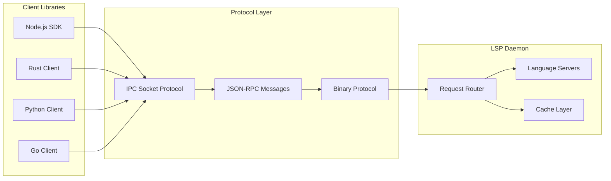

# LSP Indexing API Reference

This document provides comprehensive API documentation for developers who want to integrate with Probe's LSP indexing system, including client libraries, protocol specifications, and integration examples.

## API Overview

Probe's LSP indexing system provides multiple integration points:



## Protocol Specification

### Transport Layer

Probe uses Unix domain sockets (Unix/macOS) or named pipes (Windows) for IPC communication:

**Socket Paths**:
- **Unix/macOS**: `/tmp/probe-lsp-daemon-{uid}.sock`
- **Windows**: `\\.\pipe\probe-lsp-daemon-{uid}`

**Protocol**: Binary protocol with JSON serialization

### Message Format

All messages use a binary protocol with the following structure:

```rust
// Message header (8 bytes)
struct MessageHeader {
    magic: u32,      // 0x50524F42 ("PROB")
    length: u32,     // Payload length in bytes
}

// Message payload
struct Message {
    request_id: String,    // UUID v4
    message_type: MessageType,
    payload: serde_json::Value,
}
```

### Request/Response Types

#### Core Request Types

```rust
#[derive(Serialize, Deserialize)]
pub enum DaemonRequest {
    /// Extract code with LSP information
    ExtractWithLsp {
        request_id: Uuid,
        file_path: PathBuf,
        line: u32,
        column: u32,
        symbol_name: Option<String>,
        workspace_hint: Option<PathBuf>,
    },
    
    /// Get call hierarchy for a symbol
    CallHierarchy {
        request_id: Uuid,
        file_path: PathBuf,
        line: u32,
        column: u32,
        workspace_hint: Option<PathBuf>,
    },
    
    /// Get definition location
    Definition {
        request_id: Uuid,
        file_path: PathBuf,
        line: u32,
        column: u32,
        language: Language,
        workspace_hint: Option<PathBuf>,
    },
    
    /// Find all references
    References {
        request_id: Uuid,
        file_path: PathBuf,
        line: u32,
        column: u32,
        include_declaration: bool,
        language: Language,
        workspace_hint: Option<PathBuf>,
    },
    
    /// Get hover information
    Hover {
        request_id: Uuid,
        file_path: PathBuf,
        line: u32,
        column: u32,
        language: Language,
        workspace_hint: Option<PathBuf>,
    },
    
    /// Initialize workspaces
    InitWorkspaces {
        request_id: Uuid,
        workspace_root: PathBuf,
        languages: Option<Vec<Language>>,
        recursive: bool,
    },
    
    /// Get daemon status
    Status {
        request_id: Uuid,
        detailed: bool,
    },
    
    /// Shutdown daemon
    Shutdown {
        request_id: Uuid,
        timeout_secs: Option<u64>,
    },
}
```

#### Response Types

```rust
#[derive(Serialize, Deserialize)]
pub enum DaemonResponse {
    /// Extraction result with LSP data
    ExtractionResult {
        request_id: Uuid,
        file_path: PathBuf,
        content: String,
        lsp_info: Option<CallHierarchyInfo>,
        symbol_info: Option<SymbolInfo>,
    },
    
    /// Call hierarchy result
    CallHierarchyResult {
        request_id: Uuid,
        incoming_calls: Vec<CallInfo>,
        outgoing_calls: Vec<CallInfo>,
    },
    
    /// Definition locations
    DefinitionResult {
        request_id: Uuid,
        locations: Vec<LocationInfo>,
    },
    
    /// Reference locations
    ReferencesResult {
        request_id: Uuid,
        locations: Vec<LocationInfo>,
    },
    
    /// Hover information
    HoverResult {
        request_id: Uuid,
        hover_info: Option<HoverInfo>,
    },
    
    /// Workspace initialization result
    WorkspacesInitialized {
        request_id: Uuid,
        initialized: Vec<InitializedWorkspace>,
        errors: Vec<String>,
    },
    
    /// Daemon status
    StatusResult {
        request_id: Uuid,
        status: DaemonStatus,
        workspaces: Vec<WorkspaceInfo>,
        cache_stats: Option<AllCacheStats>,
    },
    
    /// Error response
    Error {
        request_id: Uuid,
        error_type: String,
        error: String,
        details: Option<serde_json::Value>,
    },
}
```

### Data Types

#### Location Information

```rust
#[derive(Serialize, Deserialize, Clone)]
pub struct LocationInfo {
    pub file_path: String,
    pub line: u32,
    pub column: u32,
    pub range: Option<RangeInfo>,
}

#[derive(Serialize, Deserialize, Clone)]
pub struct RangeInfo {
    pub start_line: u32,
    pub start_column: u32,
    pub end_line: u32,
    pub end_column: u32,
}
```

#### Call Hierarchy Information

```rust
#[derive(Serialize, Deserialize, Clone)]
pub struct CallHierarchyInfo {
    pub incoming_calls: Vec<CallInfo>,
    pub outgoing_calls: Vec<CallInfo>,
}

#[derive(Serialize, Deserialize, Clone)]
pub struct CallInfo {
    pub name: String,
    pub file_path: String,
    pub line: u32,
    pub column: u32,
    pub symbol_kind: String,
    pub container_name: Option<String>,
}
```

#### Language Types

```rust
#[derive(Serialize, Deserialize, Clone, Copy, PartialEq, Eq, Hash)]
pub enum Language {
    Rust,
    TypeScript,
    JavaScript,
    Python,
    Go,
    Java,
    C,
    Cpp,
    Unknown,
}
```

## Client Libraries

### Node.js SDK

#### Installation

```bash
npm install @buger/probe-lsp-client
```

#### Basic Usage

```typescript
import { LspClient } from '@buger/probe-lsp-client';

// Initialize client
const client = new LspClient({
    socketPath: '/tmp/probe-lsp-daemon.sock',  // Optional
    timeout: 30000,                           // Optional
    autoStart: true                           // Optional
});

// Connect to daemon
await client.connect();

// Extract code with LSP information
const result = await client.extractWithLsp({
    filePath: '/path/to/file.rs',
    line: 42,
    column: 8,
    symbolName: 'my_function'
});

console.log('Incoming calls:', result.lspInfo?.incomingCalls);
console.log('Outgoing calls:', result.lspInfo?.outgoingCalls);

// Get call hierarchy
const hierarchy = await client.callHierarchy({
    filePath: '/path/to/file.rs',
    line: 42,
    column: 8
});

// Find definitions
const definitions = await client.definition({
    filePath: '/path/to/file.rs',
    line: 42,
    column: 8,
    language: 'rust'
});

// Find references
const references = await client.references({
    filePath: '/path/to/file.rs',
    line: 42,
    column: 8,
    language: 'rust',
    includeDeclaration: true
});

// Get hover information
const hover = await client.hover({
    filePath: '/path/to/file.rs',
    line: 42,
    column: 8,
    language: 'rust'
});

// Initialize workspaces
const workspaces = await client.initWorkspaces({
    workspaceRoot: '/path/to/project',
    languages: ['rust', 'typescript'],
    recursive: true
});

// Get daemon status
const status = await client.status({ detailed: true });

// Disconnect
await client.disconnect();
```

#### Advanced Usage

```typescript
// Custom error handling
client.on('error', (error) => {
    console.error('LSP Client error:', error);
});

client.on('disconnect', () => {
    console.log('Disconnected from LSP daemon');
});

// Batch operations
const promises = [
    client.callHierarchy({ filePath: 'file1.rs', line: 10, column: 5 }),
    client.callHierarchy({ filePath: 'file2.rs', line: 20, column: 10 }),
    client.callHierarchy({ filePath: 'file3.rs', line: 30, column: 15 })
];

const results = await Promise.all(promises);

// Connection pooling
const pooledClient = new LspClient({
    poolSize: 5,
    maxRetries: 3,
    retryDelay: 1000
});
```

#### TypeScript Definitions

```typescript
export interface LspClientOptions {
    socketPath?: string;
    timeout?: number;
    autoStart?: boolean;
    poolSize?: number;
    maxRetries?: number;
    retryDelay?: number;
}

export interface ExtractRequest {
    filePath: string;
    line: number;
    column: number;
    symbolName?: string;
    workspaceHint?: string;
}

export interface CallHierarchyRequest {
    filePath: string;
    line: number;
    column: number;
    workspaceHint?: string;
}

export interface DefinitionRequest {
    filePath: string;
    line: number;
    column: number;
    language: Language;
    workspaceHint?: string;
}

export interface ReferencesRequest {
    filePath: string;
    line: number;
    column: number;
    includeDeclaration: boolean;
    language: Language;
    workspaceHint?: string;
}

export interface HoverRequest {
    filePath: string;
    line: number;
    column: number;
    language: Language;
    workspaceHint?: string;
}

export type Language = 'rust' | 'typescript' | 'javascript' | 'python' | 'go' | 'java' | 'c' | 'cpp';

export interface CallHierarchyInfo {
    incomingCalls: CallInfo[];
    outgoingCalls: CallInfo[];
}

export interface CallInfo {
    name: string;
    filePath: string;
    line: number;
    column: number;
    symbolKind: string;
    containerName?: string;
}

export interface LocationInfo {
    filePath: string;
    line: number;
    column: number;
    range?: RangeInfo;
}

export interface RangeInfo {
    startLine: number;
    startColumn: number;
    endLine: number;
    endColumn: number;
}
```

### Rust Client

#### Cargo.toml

```toml
[dependencies]
probe-lsp-client = "0.1.0"
tokio = { version = "1.0", features = ["full"] }
```

#### Basic Usage

```rust
use probe_lsp_client::{LspClient, Language, CallHierarchyRequest};
use std::path::PathBuf;

#[tokio::main]
async fn main() -> Result<(), Box<dyn std::error::Error>> {
    // Create client
    let mut client = LspClient::new(None).await?;
    
    // Connect to daemon
    client.connect().await?;
    
    // Extract with LSP information
    let result = client.extract_with_lsp(
        PathBuf::from("src/main.rs"),
        42,
        8,
        Some("main".to_string()),
        None
    ).await?;
    
    if let Some(lsp_info) = result.lsp_info {
        println!("Incoming calls: {:#?}", lsp_info.incoming_calls);
        println!("Outgoing calls: {:#?}", lsp_info.outgoing_calls);
    }
    
    // Call hierarchy
    let hierarchy = client.call_hierarchy(
        PathBuf::from("src/lib.rs"),
        10,
        5,
        None
    ).await?;
    
    println!("Call hierarchy: {:#?}", hierarchy);
    
    // Definition lookup
    let definitions = client.definition(
        PathBuf::from("src/main.rs"),
        42,
        8,
        Language::Rust,
        None
    ).await?;
    
    for def in definitions {
        println!("Definition at {}:{}:{}", def.file_path, def.line, def.column);
    }
    
    // References
    let references = client.references(
        PathBuf::from("src/main.rs"),
        42,
        8,
        true,  // include_declaration
        Language::Rust,
        None
    ).await?;
    
    println!("Found {} references", references.len());
    
    // Status
    let status = client.status(true).await?;
    println!("Daemon status: {:#?}", status);
    
    Ok(())
}
```

#### Advanced Patterns

```rust
use probe_lsp_client::{LspClient, CallHierarchyRequest};
use tokio::sync::Semaphore;
use std::sync::Arc;

// Concurrent requests with rate limiting
async fn analyze_functions(
    client: Arc<LspClient>,
    functions: Vec<(PathBuf, u32, u32)>
) -> Result<Vec<CallHierarchyInfo>, Box<dyn std::error::Error>> {
    let semaphore = Arc::new(Semaphore::new(10)); // Max 10 concurrent requests
    
    let tasks: Vec<_> = functions.into_iter().map(|(file, line, col)| {
        let client = Arc::clone(&client);
        let semaphore = Arc::clone(&semaphore);
        
        tokio::spawn(async move {
            let _permit = semaphore.acquire().await.unwrap();
            client.call_hierarchy(file, line, col, None).await
        })
    }).collect();
    
    let mut results = Vec::new();
    for task in tasks {
        results.push(task.await??);
    }
    
    Ok(results)
}

// Connection pooling
struct LspClientPool {
    clients: Vec<LspClient>,
    current: std::sync::atomic::AtomicUsize,
}

impl LspClientPool {
    async fn new(pool_size: usize) -> Result<Self, Box<dyn std::error::Error>> {
        let mut clients = Vec::new();
        for _ in 0..pool_size {
            let mut client = LspClient::new(None).await?;
            client.connect().await?;
            clients.push(client);
        }
        
        Ok(LspClientPool {
            clients,
            current: std::sync::atomic::AtomicUsize::new(0),
        })
    }
    
    fn get_client(&self) -> &LspClient {
        let index = self.current.fetch_add(1, std::sync::atomic::Ordering::Relaxed) % self.clients.len();
        &self.clients[index]
    }
}
```

### Python Client

#### Installation

```bash
pip install probe-lsp-client
```

#### Basic Usage

```python
import asyncio
from probe_lsp_client import LspClient, Language

async def main():
    # Create and connect client
    client = LspClient()
    await client.connect()
    
    try:
        # Extract with LSP information
        result = await client.extract_with_lsp(
            file_path="/path/to/file.py",
            line=42,
            column=8,
            symbol_name="my_function"
        )
        
        if result.lsp_info:
            print(f"Incoming calls: {result.lsp_info.incoming_calls}")
            print(f"Outgoing calls: {result.lsp_info.outgoing_calls}")
        
        # Call hierarchy
        hierarchy = await client.call_hierarchy(
            file_path="/path/to/file.py",
            line=42,
            column=8
        )
        
        # Definition
        definitions = await client.definition(
            file_path="/path/to/file.py",
            line=42,
            column=8,
            language=Language.PYTHON
        )
        
        for defn in definitions:
            print(f"Definition: {defn.file_path}:{defn.line}:{defn.column}")
        
        # References
        references = await client.references(
            file_path="/path/to/file.py",
            line=42,
            column=8,
            include_declaration=True,
            language=Language.PYTHON
        )
        
        print(f"Found {len(references)} references")
        
        # Status
        status = await client.status(detailed=True)
        print(f"Daemon uptime: {status.uptime}")
        
    finally:
        await client.disconnect()

if __name__ == "__main__":
    asyncio.run(main())
```

#### Advanced Usage

```python
import asyncio
from typing import List, Tuple
from probe_lsp_client import LspClient, CallHierarchyInfo

class LspAnalyzer:
    def __init__(self, socket_path: str = None):
        self.client = LspClient(socket_path=socket_path)
    
    async def __aenter__(self):
        await self.client.connect()
        return self
    
    async def __aexit__(self, exc_type, exc_val, exc_tb):
        await self.client.disconnect()
    
    async def analyze_call_graph(self, functions: List[Tuple[str, int, int]]) -> List[CallHierarchyInfo]:
        """Analyze call graph for multiple functions concurrently."""
        semaphore = asyncio.Semaphore(10)  # Limit concurrent requests
        
        async def analyze_function(file_path: str, line: int, column: int):
            async with semaphore:
                return await self.client.call_hierarchy(
                    file_path=file_path,
                    line=line,
                    column=column
                )
        
        tasks = [
            analyze_function(file_path, line, column)
            for file_path, line, column in functions
        ]
        
        return await asyncio.gather(*tasks)
    
    async def find_all_callers(self, file_path: str, line: int, column: int) -> List[str]:
        """Find all functions that call the specified function."""
        hierarchy = await self.client.call_hierarchy(
            file_path=file_path,
            line=line,
            column=column
        )
        
        callers = []
        for call in hierarchy.incoming_calls:
            callers.append(f"{call.name} ({call.file_path}:{call.line})")
        
        return callers

# Usage
async def analyze_project():
    async with LspAnalyzer() as analyzer:
        # Analyze multiple functions
        functions = [
            ("/path/to/main.py", 10, 5),
            ("/path/to/utils.py", 25, 10),
            ("/path/to/handler.py", 50, 15)
        ]
        
        results = await analyzer.analyze_call_graph(functions)
        
        for i, result in enumerate(results):
            file_path, line, column = functions[i]
            print(f"\nFunction at {file_path}:{line}:{column}")
            print(f"  Incoming calls: {len(result.incoming_calls)}")
            print(f"  Outgoing calls: {len(result.outgoing_calls)}")
```

### Go Client

#### go.mod

```go
module your-project

go 1.21

require github.com/buger/probe-lsp-client v0.1.0
```

#### Basic Usage

```go
package main

import (
    "context"
    "fmt"
    "log"
    
    "github.com/buger/probe-lsp-client"
)

func main() {
    // Create client
    client, err := lspclient.New(lspclient.Options{})
    if err != nil {
        log.Fatal(err)
    }
    defer client.Close()
    
    ctx := context.Background()
    
    // Connect to daemon
    if err := client.Connect(ctx); err != nil {
        log.Fatal(err)
    }
    
    // Extract with LSP information
    result, err := client.ExtractWithLSP(ctx, lspclient.ExtractRequest{
        FilePath:   "/path/to/file.go",
        Line:       42,
        Column:     8,
        SymbolName: "MyFunction",
    })
    if err != nil {
        log.Fatal(err)
    }
    
    if result.LSPInfo != nil {
        fmt.Printf("Incoming calls: %d\n", len(result.LSPInfo.IncomingCalls))
        fmt.Printf("Outgoing calls: %d\n", len(result.LSPInfo.OutgoingCalls))
    }
    
    // Call hierarchy
    hierarchy, err := client.CallHierarchy(ctx, lspclient.CallHierarchyRequest{
        FilePath: "/path/to/file.go",
        Line:     42,
        Column:   8,
    })
    if err != nil {
        log.Fatal(err)
    }
    
    fmt.Printf("Call hierarchy: %+v\n", hierarchy)
    
    // Definition
    definitions, err := client.Definition(ctx, lspclient.DefinitionRequest{
        FilePath: "/path/to/file.go",
        Line:     42,
        Column:   8,
        Language: lspclient.LanguageGo,
    })
    if err != nil {
        log.Fatal(err)
    }
    
    for _, def := range definitions {
        fmt.Printf("Definition: %s:%d:%d\n", def.FilePath, def.Line, def.Column)
    }
    
    // Status
    status, err := client.Status(ctx, lspclient.StatusRequest{Detailed: true})
    if err != nil {
        log.Fatal(err)
    }
    
    fmt.Printf("Daemon status: %+v\n", status)
}
```

## Integration Examples

### AI Code Assistant Integration

```typescript
// AI assistant with LSP context
import { LspClient } from '@buger/probe-lsp-client';
import { OpenAI } from 'openai';

class AICodeAssistant {
    private lspClient: LspClient;
    private openai: OpenAI;
    
    constructor() {
        this.lspClient = new LspClient({ autoStart: true });
        this.openai = new OpenAI();
    }
    
    async analyzeFunction(filePath: string, line: number, column: number): Promise<string> {
        // Get LSP context
        const [hierarchy, hover, definitions] = await Promise.all([
            this.lspClient.callHierarchy({ filePath, line, column }),
            this.lspClient.hover({ filePath, line, column, language: 'rust' }),
            this.lspClient.definition({ filePath, line, column, language: 'rust' })
        ]);
        
        // Build context for AI
        const context = {
            incomingCalls: hierarchy.incomingCalls.map(call => ({
                name: call.name,
                location: `${call.filePath}:${call.line}`
            })),
            outgoingCalls: hierarchy.outgoingCalls.map(call => ({
                name: call.name,
                location: `${call.filePath}:${call.line}`
            })),
            typeInfo: hover?.contents,
            definitions: definitions.map(def => ({
                location: `${def.filePath}:${def.line}`
            }))
        };
        
        // Query AI with rich context
        const response = await this.openai.chat.completions.create({
            model: "gpt-4",
            messages: [{
                role: "user",
                content: `Analyze this function with the following LSP context:
                
                Call Hierarchy:
                - Called by: ${context.incomingCalls.map(c => c.name).join(', ')}
                - Calls: ${context.outgoingCalls.map(c => c.name).join(', ')}
                
                Type Information: ${context.typeInfo}
                
                Please provide insights about this function's role and suggestions for improvement.`
            }]
        });
        
        return response.choices[0].message.content || "No analysis available";
    }
}
```

### Code Documentation Generator

```python
import asyncio
from probe_lsp_client import LspClient, Language

class DocumentationGenerator:
    def __init__(self):
        self.client = LspClient()
    
    async def generate_docs(self, file_path: str, language: Language) -> str:
        """Generate documentation for all functions in a file."""
        await self.client.connect()
        
        try:
            # Get all symbols in the file
            symbols = await self.client.document_symbols(
                file_path=file_path,
                language=language
            )
            
            docs = []
            for symbol in symbols:
                if symbol.kind == "function":
                    # Get call hierarchy and hover info
                    hierarchy = await self.client.call_hierarchy(
                        file_path=file_path,
                        line=symbol.line,
                        column=symbol.column
                    )
                    
                    hover = await self.client.hover(
                        file_path=file_path,
                        line=symbol.line,
                        column=symbol.column,
                        language=language
                    )
                    
                    # Generate documentation
                    doc = self._generate_function_doc(symbol, hierarchy, hover)
                    docs.append(doc)
            
            return "\n\n".join(docs)
            
        finally:
            await self.client.disconnect()
    
    def _generate_function_doc(self, symbol, hierarchy, hover):
        """Generate documentation for a single function."""
        lines = [f"## {symbol.name}"]
        
        if hover and hover.contents:
            lines.append(f"**Type**: {hover.contents}")
        
        if hierarchy.incoming_calls:
            lines.append("**Called by**:")
            for call in hierarchy.incoming_calls:
                lines.append(f"- {call.name} ({call.file_path}:{call.line})")
        
        if hierarchy.outgoing_calls:
            lines.append("**Calls**:")
            for call in hierarchy.outgoing_calls:
                lines.append(f"- {call.name} ({call.file_path}:{call.line})")
        
        return "\n".join(lines)
```

### Build System Integration

```bash
#!/bin/bash
# build-with-lsp-analysis.sh

set -e

echo "Starting build with LSP analysis..."

# Start LSP daemon
probe lsp start

# Initialize workspaces
probe lsp init-workspaces . --recursive

# Pre-build analysis
echo "Analyzing codebase structure..."

# Get all public functions
PUBLIC_FUNCTIONS=$(probe search "pub fn" --lsp --max-results 1000 --output json | \
    jq -r '.[] | "\(.file_path):\(.line_number):\(.column)"')

# Analyze call graphs for critical functions
echo "Analyzing call graphs..."
ANALYSIS_RESULTS=""

while IFS= read -r func_location; do
    if [[ -n "$func_location" ]]; then
        FILE_PATH=$(echo "$func_location" | cut -d: -f1)
        LINE=$(echo "$func_location" | cut -d: -f2)
        COLUMN=$(echo "$func_location" | cut -d: -f3)
        
        # Get call hierarchy
        HIERARCHY=$(probe extract "$FILE_PATH#$LINE" --lsp --output json 2>/dev/null || echo "{}")
        
        # Check for potential issues
        INCOMING_COUNT=$(echo "$HIERARCHY" | jq '.lsp_info.incoming_calls | length' 2>/dev/null || echo "0")
        OUTGOING_COUNT=$(echo "$HIERARCHY" | jq '.lsp_info.outgoing_calls | length' 2>/dev/null || echo "0")
        
        # Flag functions with unusual characteristics
        if (( INCOMING_COUNT == 0 && OUTGOING_COUNT > 10 )); then
            echo "WARNING: $FILE_PATH:$LINE may have too many dependencies ($OUTGOING_COUNT calls)"
        elif (( INCOMING_COUNT > 20 )); then
            echo "WARNING: $FILE_PATH:$LINE is heavily used ($INCOMING_COUNT callers)"
        fi
    fi
done <<< "$PUBLIC_FUNCTIONS"

# Regular build
echo "Running build..."
cargo build --release

# Post-build analysis
echo "Post-build LSP analysis complete"
probe lsp status

echo "Build completed successfully"
```

## Error Handling

### Error Types

```rust
#[derive(Debug, Serialize, Deserialize)]
pub enum LspErrorType {
    /// Connection errors
    ConnectionFailed,
    ConnectionTimeout,
    ConnectionLost,
    
    /// Protocol errors
    InvalidRequest,
    InvalidResponse,
    ProtocolViolation,
    
    /// LSP server errors
    ServerNotAvailable,
    ServerTimeout,
    ServerCrash,
    
    /// File system errors
    FileNotFound,
    FileNotReadable,
    WorkspaceNotFound,
    
    /// Cache errors
    CacheCorrupted,
    CacheWriteError,
    
    /// Configuration errors
    InvalidConfiguration,
    PermissionDenied,
}
```

### Error Handling Examples

```typescript
// TypeScript error handling
try {
    const result = await client.callHierarchy({
        filePath: '/path/to/file.rs',
        line: 42,
        column: 8
    });
} catch (error) {
    if (error.type === 'ServerNotAvailable') {
        // Retry with auto-start
        await client.initWorkspaces({
            workspaceRoot: '/path/to/project',
            languages: ['rust']
        });
        
        // Retry the operation
        const result = await client.callHierarchy({
            filePath: '/path/to/file.rs',
            line: 42,
            column: 8
        });
    } else if (error.type === 'FileNotFound') {
        console.error(`File not found: ${error.details.filePath}`);
    } else {
        throw error; // Re-throw unexpected errors
    }
}
```

```rust
// Rust error handling
use probe_lsp_client::{LspClient, LspError, LspErrorType};

match client.call_hierarchy(file_path, line, column, None).await {
    Ok(hierarchy) => {
        // Handle success
        println!("Call hierarchy: {:#?}", hierarchy);
    }
    Err(LspError::Server { error_type: LspErrorType::ServerNotAvailable, .. }) => {
        // Try to start the server
        eprintln!("Language server not available, attempting to initialize...");
        
        client.init_workspaces(
            workspace_root,
            Some(vec![Language::Rust]),
            false
        ).await?;
        
        // Retry the operation
        let hierarchy = client.call_hierarchy(file_path, line, column, None).await?;
        println!("Call hierarchy: {:#?}", hierarchy);
    }
    Err(LspError::Timeout { .. }) => {
        eprintln!("Request timed out, language server may be indexing");
        // Could implement retry with exponential backoff
    }
    Err(error) => {
        eprintln!("LSP error: {}", error);
        return Err(error.into());
    }
}
```

## Performance Considerations

### Connection Management

```typescript
// Efficient connection management
class LspClientManager {
    private clients: Map<string, LspClient> = new Map();
    private maxClients = 5;
    
    async getClient(workspaceRoot: string): Promise<LspClient> {
        if (this.clients.has(workspaceRoot)) {
            return this.clients.get(workspaceRoot)!;
        }
        
        if (this.clients.size >= this.maxClients) {
            // Remove least recently used client
            const [oldestKey] = this.clients.keys();
            const oldClient = this.clients.get(oldestKey)!;
            await oldClient.disconnect();
            this.clients.delete(oldestKey);
        }
        
        const client = new LspClient();
        await client.connect();
        this.clients.set(workspaceRoot, client);
        
        return client;
    }
    
    async shutdown(): Promise<void> {
        for (const client of this.clients.values()) {
            await client.disconnect();
        }
        this.clients.clear();
    }
}
```

### Request Batching

```python
# Batch multiple requests for better performance
class BatchLspClient:
    def __init__(self):
        self.client = LspClient()
        self.batch_size = 10
        self.batch_timeout = 0.1  # 100ms
    
    async def batch_call_hierarchy(self, requests: List[Tuple[str, int, int]]) -> List[CallHierarchyInfo]:
        """Process multiple call hierarchy requests in batches."""
        results = []
        
        for i in range(0, len(requests), self.batch_size):
            batch = requests[i:i + self.batch_size]
            
            # Process batch concurrently
            tasks = [
                self.client.call_hierarchy(file_path, line, column)
                for file_path, line, column in batch
            ]
            
            batch_results = await asyncio.gather(*tasks, return_exceptions=True)
            
            # Handle exceptions in batch
            for result in batch_results:
                if isinstance(result, Exception):
                    results.append(None)  # or handle error appropriately
                else:
                    results.append(result)
            
            # Small delay between batches to avoid overwhelming the server
            if i + self.batch_size < len(requests):
                await asyncio.sleep(self.batch_timeout)
        
        return results
```

## Next Steps

- **[Overview Guide](./indexing-overview.md)** - Start here for LSP indexing basics
- **[Configuration Reference](./indexing-configuration.md)** - Complete configuration options
- **[Performance Guide](./indexing-performance.md)** - Optimization strategies
- **[Architecture Guide](./indexing-architecture.md)** - Understanding system internals