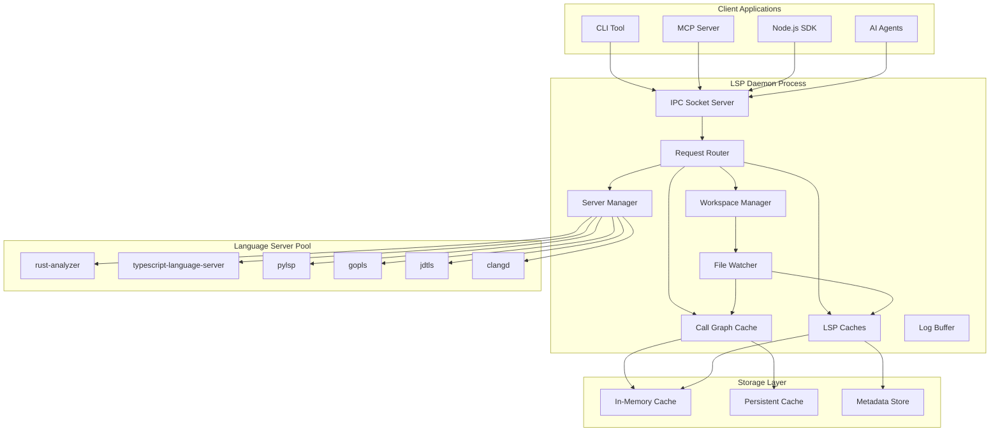
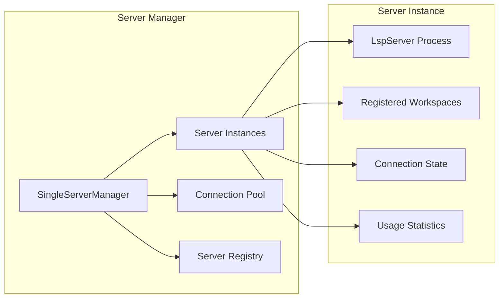
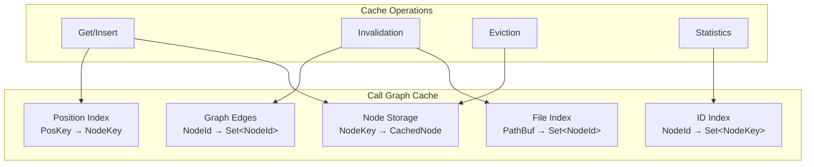
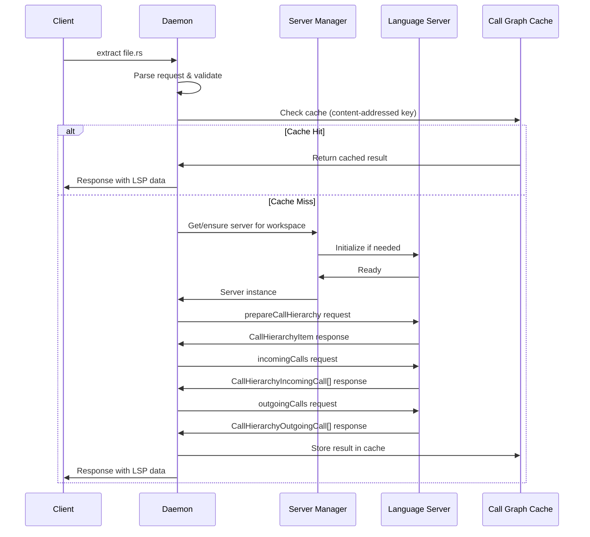
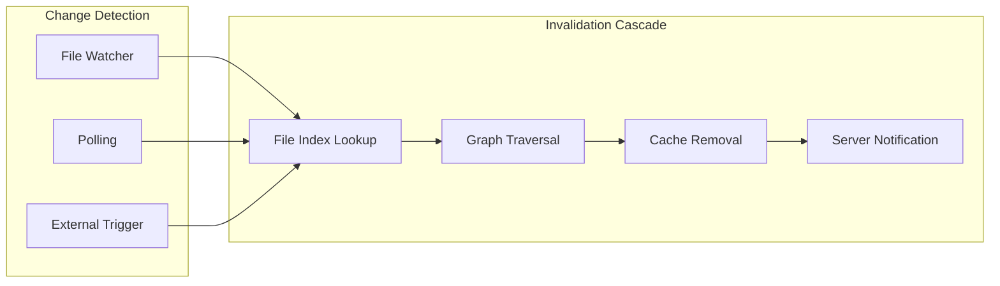
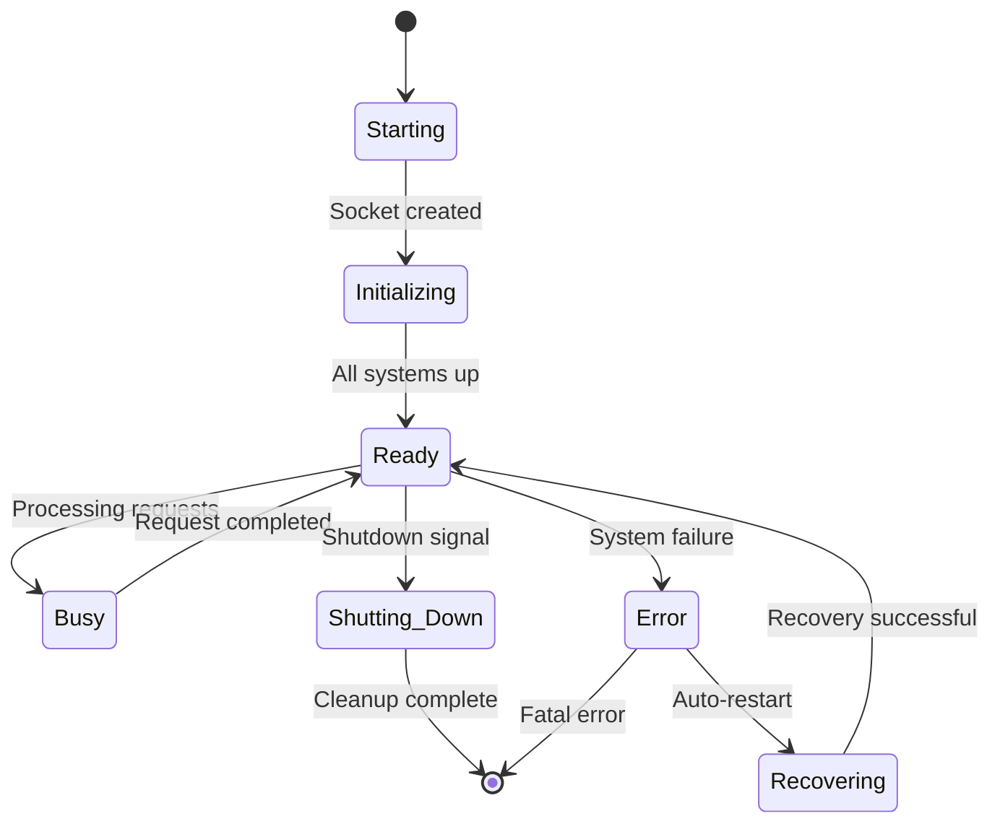
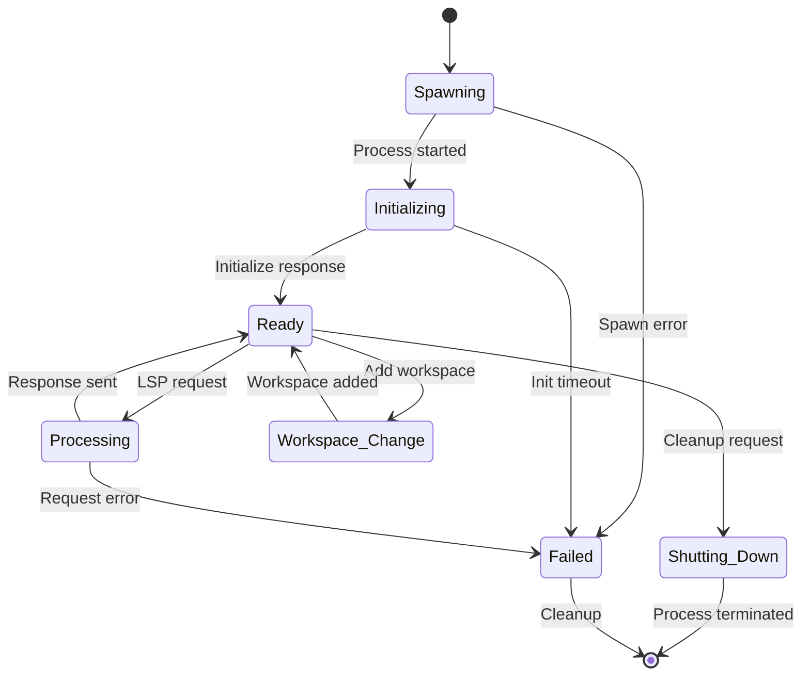
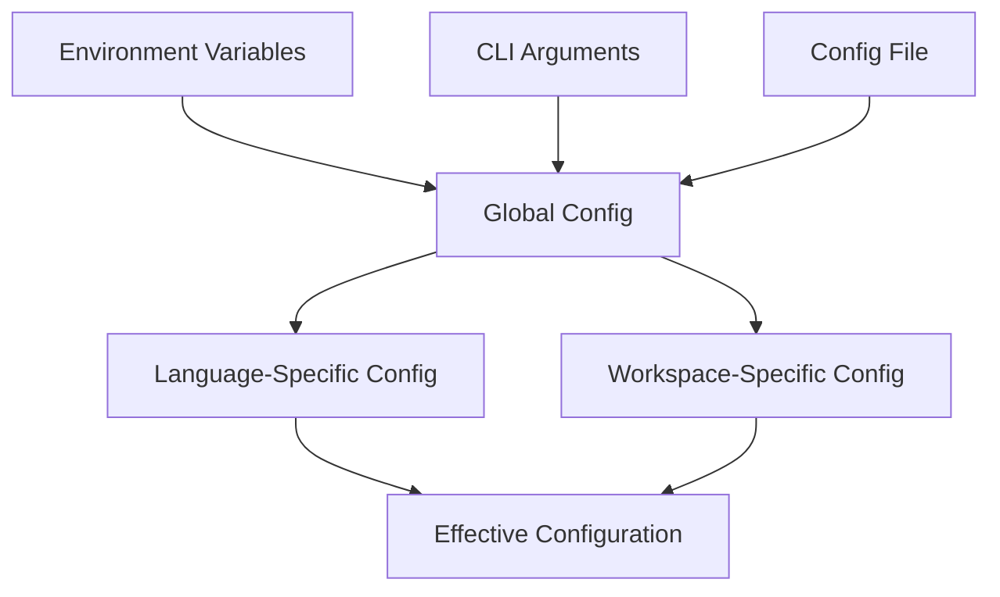

# LSP Indexing Architecture

This document provides a comprehensive technical overview of Probe's LSP indexing system architecture, covering the internal components, data flow, caching mechanisms, and design decisions.

## System Overview



## Core Components

### LSP Daemon

The central orchestration service that manages all indexing operations.

```rust
pub struct LspDaemon {
    // IPC communication
    socket_path: PathBuf,
    connections: Arc<DashMap<Uuid, Connection>>,
    
    // Core managers
    server_manager: Arc<SingleServerManager>,
    workspace_resolver: Arc<Mutex<WorkspaceResolver>>,
    
    // Caching layer
    call_graph_cache: Arc<CallGraphCache>,
    definition_cache: Arc<LspCache<DefinitionInfo>>,
    references_cache: Arc<LspCache<ReferencesInfo>>,
    hover_cache: Arc<LspCache<HoverInfo>>,
    
    // Monitoring and observability
    log_buffer: Arc<CircularLogBuffer>,
    request_durations: Arc<RwLock<VecDeque<Duration>>>,
    
    // Configuration
    indexing_config: IndexingConfig,
}
```

**Key Responsibilities:**
- IPC socket management for client communication
- Request routing and response handling
- Coordinator for all subsystems
- Metrics collection and observability
- Graceful shutdown and error recovery

### Server Manager

Manages the lifecycle and pooling of language server processes.



```rust
pub struct SingleServerManager {
    // Language to server instance mapping
    servers: DashMap<Language, Arc<Mutex<ServerInstance>>>,
    
    // Server configurations
    registry: Arc<LspServerRegistry>,
    
    // Workspace tracking
    workspace_servers: DashMap<(Language, PathBuf), Arc<Mutex<ServerInstance>>>,
}

pub struct ServerInstance {
    pub server: LspServer,
    pub registered_workspaces: HashSet<PathBuf>,
    pub initialized: bool,
    pub last_used: Instant,
    pub start_time: Instant,
    pub bootstrap_workspace: Option<PathBuf>,
}
```

**Architecture Patterns:**
- **One Server Per Language**: Single long-lived process per language type
- **Workspace Registration**: Multiple workspaces can share same server
- **Lazy Initialization**: Servers start on first request
- **Health Monitoring**: Automatic restart on crashes
- **Graceful Cleanup**: Proper shutdown with workspace notification

### Workspace Resolver

Discovers and maps files to appropriate project workspaces.

```rust
pub struct WorkspaceResolver {
    allowed_roots: Option<Vec<PathBuf>>,
    workspace_cache: HashMap<PathBuf, PathBuf>, // file_dir -> workspace_root
    max_cache_size: usize,
}
```

**Discovery Algorithm:**
1. **Start from file directory**
2. **Walk up directory tree** looking for project markers:
   - `Cargo.toml` (Rust)
   - `package.json` (JavaScript/TypeScript)
   - `go.mod` (Go)
   - `pyproject.toml`, `setup.py` (Python)
   - `pom.xml`, `build.gradle` (Java)
   - `.git` directory (fallback)
3. **Cache resolved mappings** for performance
4. **Validate against allowed roots** for security

## Caching Architecture

### Content-Addressed Caching

The system uses content-based cache keys to ensure correctness across code changes:

```rust
pub struct LspCacheKey {
    pub file: PathBuf,
    pub line: u32,
    pub column: u32,
    pub content_md5: String,  // File content hash
    pub operation: LspOperation,
    pub extra_params: Option<String>,
}
```

**Benefits:**
- **Version Control Safe**: Cache survives git operations
- **Build System Friendly**: Works with generated files
- **Collaboration Ready**: Teams share cache hits
- **Correctness**: Automatic invalidation on content changes

### Call Graph Cache

Specialized high-performance cache for call hierarchy data:



```rust
pub struct CallGraphCache {
    // Main storage: versioned cache entries
    nodes: DashMap<NodeKey, Arc<CachedNode>>,
    
    // Indexes for efficient operations
    id_to_keys: DashMap<NodeId, HashSet<NodeKey>>,
    outgoing: DashMap<NodeId, HashSet<NodeId>>,
    incoming: DashMap<NodeId, HashSet<NodeId>>,
    file_index: DashMap<PathBuf, HashSet<NodeId>>,
    pos_index: DashMap<PosKey, NodeKey>,
    
    // Deduplication and metadata
    inflight: DashMap<NodeKey, Arc<AsyncMutex<()>>>,
    access_meta: DashMap<NodeKey, AccessMeta>,
}
```

**Cache Operations:**

1. **Lookup**: Check position index → get NodeKey → retrieve cached node
2. **Insert**: Store node + update all indexes + build graph edges
3. **Invalidation**: Find affected nodes via file/graph index → remove + cascade
4. **Eviction**: LRU-based removal when capacity exceeded

### Multi-Level LSP Caches

Separate caches for different LSP operations:

```rust
pub struct LspCache<T> {
    operation: LspOperation,
    entries: DashMap<LspCacheKey, Arc<CachedLspNode<T>>>,
    file_index: DashMap<PathBuf, HashSet<LspCacheKey>>,
    inflight: DashMap<LspCacheKey, Arc<AsyncMutex<()>>>,
    persistent_store: Option<Arc<sled::Db>>,
}
```

**Supported Operations:**
- **Definition**: Go-to-definition results
- **References**: Find-all-references results  
- **Hover**: Type information and documentation
- **DocumentSymbols**: File-level symbol information

## Data Flow

### Request Processing Pipeline



### File Change Propagation



**Invalidation Strategy:**
1. **File-Level**: Remove all cache entries for changed file
2. **Graph-Aware**: Traverse call graph to find dependent symbols
3. **Bounded Propagation**: Limit traversal depth to prevent cascades
4. **Lazy Cleanup**: Remove stale entries on next access

## Process Architecture

### Daemon Lifecycle



**Process Management:**
- **Automatic Start**: Daemon starts on first client request
- **PID Lock**: Prevents multiple daemon instances
- **Signal Handling**: Graceful shutdown on SIGTERM/SIGINT
- **Child Cleanup**: Orphaned language servers are terminated
- **Recovery**: Automatic restart on non-fatal errors

### Language Server Lifecycle



## Memory Management

### Cache Size Control

```rust
pub struct CacheConfig {
    // Per-operation limits
    capacity_per_operation: usize,        // 500 entries default
    
    // Time-based eviction
    ttl: Duration,                        // 30 minutes default
    eviction_check_interval: Duration,    // 1 minute default
    
    // Memory pressure handling
    max_memory_mb: Option<u64>,
    pressure_threshold: f64,              // 0.8 default
}
```

**Memory Strategy:**
- **LRU Eviction**: Least recently used entries removed first
- **TTL Expiration**: Automatic cleanup of old entries
- **Memory Monitoring**: Optional memory pressure detection
- **Configurable Limits**: Per-operation and global limits

### Process Monitoring

```rust
pub struct ProcessMonitor {
    // Memory tracking
    peak_memory_mb: Arc<AtomicU64>,
    current_memory_mb: Arc<AtomicU64>,
    
    // Process health
    child_processes: Arc<DashMap<u32, ProcessInfo>>,
    last_health_check: Arc<AtomicU64>,
    
    // Performance metrics
    request_latencies: Arc<RwLock<VecDeque<Duration>>>,
    cache_hit_rates: Arc<RwLock<HashMap<LspOperation, f64>>>,
}
```

## Configuration System

### Hierarchical Configuration



**Configuration Sources** (priority order):
1. **Command-line arguments** (highest priority)
2. **Environment variables**
3. **Configuration files**
4. **Built-in defaults** (lowest priority)

### Dynamic Reconfiguration

Some configuration can be changed at runtime:
- Cache sizes and TTL values
- Log levels
- File watching parameters
- Memory limits

## Error Handling and Recovery

### Error Categories

```rust
pub enum LspError {
    // Connection errors
    ServerNotAvailable(Language),
    WorkspaceNotFound(PathBuf),
    CommunicationTimeout,
    
    // Protocol errors
    InvalidRequest(String),
    ProtocolViolation(String),
    UnsupportedOperation(LspOperation),
    
    // System errors
    FileNotFound(PathBuf),
    PermissionDenied(PathBuf),
    OutOfMemory,
    ConfigurationError(String),
}
```

**Recovery Strategies:**
- **Transient Errors**: Automatic retry with exponential backoff
- **Server Crashes**: Restart language server and invalidate cache
- **Memory Pressure**: Aggressive cache eviction
- **Configuration Errors**: Fallback to safe defaults

## Performance Characteristics

### Latency Profile

| Operation | Cold Start | Warm Cache | P95 Latency |
|-----------|------------|------------|-------------|
| Call Hierarchy | 200-2000ms | 1-5ms | 10ms |
| Definition | 50-500ms | 1-3ms | 8ms |
| References | 100-1000ms | 2-8ms | 15ms |
| Hover | 30-200ms | 1-2ms | 5ms |

### Throughput Characteristics

- **Concurrent Requests**: 50-100 per second (bounded by language servers)
- **Cache Hit Rate**: 85-95% in typical development workflows  
- **Memory Usage**: 50-200MB for daemon + 100-500MB per language server
- **Startup Time**: 100-500ms for daemon, 2-30s for language server initialization

## Security Considerations

### Access Control

```rust
pub struct WorkspaceResolver {
    allowed_roots: Option<Vec<PathBuf>>,  // Restrict workspace access
    // ...
}
```

- **Workspace Isolation**: Only access allowed project roots
- **Path Validation**: Prevent directory traversal attacks
- **Process Isolation**: Language servers run as separate processes
- **Socket Permissions**: IPC socket restricted to user/group

### Data Protection

- **No Network Access**: All operations are local-only
- **Temporary Files**: Cleaned up on process exit
- **Cache Encryption**: Optional encryption for persistent cache
- **Audit Logging**: Optional detailed operation logging

## Monitoring and Observability

### Metrics Collection

```rust
pub struct DaemonMetrics {
    // Request metrics
    request_count: Arc<AtomicU64>,
    request_durations: Arc<RwLock<VecDeque<Duration>>>,
    error_count: Arc<AtomicU64>,
    
    // Cache metrics
    cache_hits: Arc<AtomicU64>,
    cache_misses: Arc<AtomicU64>,
    cache_evictions: Arc<AtomicU64>,
    
    // System metrics
    memory_usage: Arc<AtomicU64>,
    active_connections: Arc<AtomicU64>,
    language_server_count: Arc<AtomicU64>,
}
```

### Logging System

```rust
pub struct CircularLogBuffer {
    entries: RwLock<VecDeque<LogEntry>>,
    max_size: usize,                      // 1000 entries default
    total_written: AtomicU64,
}

pub struct LogEntry {
    timestamp: SystemTime,
    level: LogLevel,
    target: String,
    message: String,
    file: Option<String>,
    line: Option<u32>,
}
```

**Log Categories:**
- **LSP Protocol**: Request/response JSON-RPC messages
- **Cache Operations**: Hit/miss/eviction events
- **Process Management**: Server start/stop/crash events
- **Performance**: Request latencies and memory usage
- **Errors**: All error conditions with context

## Next Steps

- **[Configuration Reference](./indexing-configuration.md)** - Detailed configuration options
- **[Performance Guide](./indexing-performance.md)** - Optimization strategies
- **[API Reference](./indexing-api-reference.md)** - Integration guide for developers