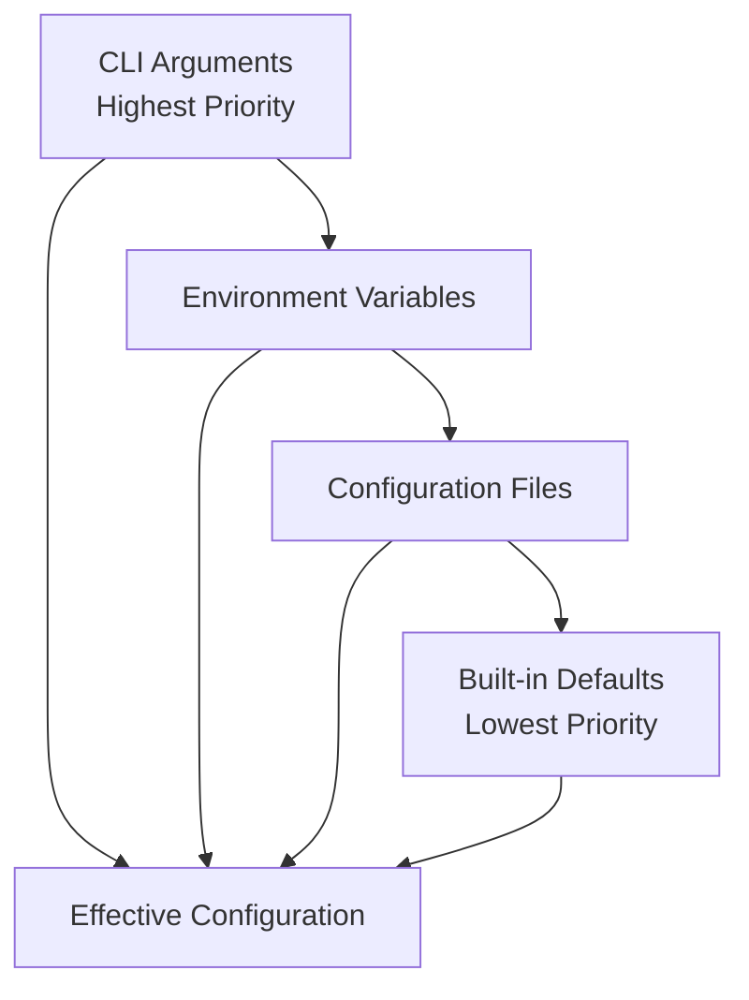

# LSP Indexing Configuration Reference

This document provides comprehensive configuration options for Probe's LSP indexing system, including environment variables, CLI flags, configuration files, and runtime settings.

## Configuration Overview

Probe's LSP indexing system uses a hierarchical configuration approach:



## Environment Variables

### Core LSP Settings

| Variable | Type | Default | Description |
|----------|------|---------|-------------|
| `PROBE_LSP_SOCKET` | String | Auto-detected | Custom socket path for daemon IPC |
| `PROBE_LSP_TIMEOUT` | Integer | `30000` | Request timeout in milliseconds |
| `PROBE_LSP_LOG_LEVEL` | String | `info` | Log level: `error`, `warn`, `info`, `debug`, `trace` |
| `PROBE_LSP_AUTO_START` | Boolean | `true` | Auto-start daemon on first request |
| `PROBE_LSP_MAX_CONNECTIONS` | Integer | `100` | Maximum concurrent client connections |

```bash
# Example usage
export PROBE_LSP_TIMEOUT=60000        # 60 second timeout
export PROBE_LSP_LOG_LEVEL=debug      # Verbose logging
export PROBE_LSP_SOCKET=/tmp/my-probe-daemon.sock

probe extract src/main.rs#main --lsp
```

### Cache Configuration

#### Persistent Cache Settings

| Variable | Type | Default | Description |
|----------|------|---------|-------------|
| `PROBE_LSP_PERSISTENCE_ENABLED` | Boolean | `false` | Enable persistent cache (survives restarts) |
| `PROBE_LSP_PERSISTENCE_PATH` | String | `~/.cache/probe/lsp/call_graph.db` | Persistent cache database path |
| `PROBE_LSP_CACHE_SIZE_MB` | Integer | `512` | Memory cache size limit in MB |
| `PROBE_LSP_PERSISTENCE_SIZE_MB` | Integer | `2048` | Persistent cache size limit in MB |
| `PROBE_LSP_CACHE_TTL_DAYS` | Integer | `30` | Auto-cleanup threshold in days |
| `PROBE_LSP_CACHE_COMPRESS` | Boolean | `true` | Enable compression for persistent storage |


#### Performance Tuning

| Variable | Type | Default | Description |
|----------|------|---------|-------------|
| `PROBE_LSP_PERSISTENCE_BATCH_SIZE` | Integer | `50` | Batch size for bulk operations |
| `PROBE_LSP_PERSISTENCE_INTERVAL_MS` | Integer | `1000` | Write frequency in milliseconds |

```bash
# High-performance persistent cache configuration
export PROBE_LSP_PERSISTENCE_ENABLED=true
export PROBE_LSP_PERSISTENCE_PATH=/fast/ssd/probe-lsp/call_graph.db
export PROBE_LSP_CACHE_SIZE_MB=1024
export PROBE_LSP_PERSISTENCE_SIZE_MB=4096
export PROBE_LSP_CACHE_TTL_DAYS=60
export PROBE_LSP_CACHE_COMPRESS=true

# MD5-based cache invalidation - works in all environments
# No git dependencies required

# Performance tuning
export PROBE_LSP_PERSISTENCE_BATCH_SIZE=100
export PROBE_LSP_PERSISTENCE_INTERVAL_MS=500
```

### Memory Management

| Variable | Type | Default | Description |
|----------|------|---------|-------------|
| `PROBE_LSP_MEMORY_LIMIT_MB` | Integer | None | Maximum memory usage in MB |
| `PROBE_LSP_MEMORY_PRESSURE_THRESHOLD` | Float | `0.8` | Memory pressure threshold (0.0-1.0) |
| `PROBE_LSP_EVICTION_BATCH_SIZE` | Integer | `50` | Entries to evict per batch |
| `PROBE_LSP_MONITORING_INTERVAL` | Integer | `30` | Memory monitoring interval in seconds |

```bash
# Memory-constrained environment
export PROBE_LSP_MEMORY_LIMIT_MB=512
export PROBE_LSP_MEMORY_PRESSURE_THRESHOLD=0.7
export PROBE_LSP_EVICTION_BATCH_SIZE=100
```

### Language Server Settings

| Variable | Type | Default | Description |
|----------|------|---------|-------------|
| `PROBE_LSP_RUST_ANALYZER_PATH` | String | `rust-analyzer` | Path to rust-analyzer binary |
| `PROBE_LSP_TYPESCRIPT_PATH` | String | `typescript-language-server` | Path to TypeScript LSP |
| `PROBE_LSP_PYLSP_PATH` | String | `pylsp` | Path to Python LSP server |
| `PROBE_LSP_GOPLS_PATH` | String | `gopls` | Path to Go language server |
| `PROBE_LSP_JDTLS_PATH` | String | `jdtls` | Path to Java language server |
| `PROBE_LSP_CLANGD_PATH` | String | `clangd` | Path to C/C++ language server |

```bash
# Custom language server paths
export PROBE_LSP_RUST_ANALYZER_PATH=/opt/rust-analyzer/bin/rust-analyzer
export PROBE_LSP_TYPESCRIPT_PATH=/usr/local/bin/typescript-language-server
export PROBE_LSP_PYLSP_PATH=$HOME/.local/bin/pylsp
```

### Workspace Discovery

| Variable | Type | Default | Description |
|----------|------|---------|-------------|
| `PROBE_LSP_ALLOWED_ROOTS` | String | Current dir | Colon-separated allowed workspace roots |
| `PROBE_LSP_WORKSPACE_CACHE_SIZE` | Integer | `1000` | Maximum workspace mappings to cache |
| `PROBE_LSP_DISCOVERY_TIMEOUT` | Integer | `5000` | Workspace discovery timeout in ms |
| `PROBE_LSP_MAX_WORKSPACE_DEPTH` | Integer | `10` | Maximum directory traversal depth |

```bash
# Restrict to specific project directories
export PROBE_LSP_ALLOWED_ROOTS="/home/user/projects:/opt/work"

# Performance tuning
export PROBE_LSP_WORKSPACE_CACHE_SIZE=2000
export PROBE_LSP_DISCOVERY_TIMEOUT=10000
```

### File Watching

| Variable | Type | Default | Description |
|----------|------|---------|-------------|
| `PROBE_LSP_WATCH_FILES` | Boolean | `true` | Enable file change monitoring |
| `PROBE_LSP_WATCH_POLL_INTERVAL` | Integer | `1000` | Poll interval in milliseconds |
| `PROBE_LSP_WATCH_EXCLUDE_PATTERNS` | String | See below | Comma-separated exclude patterns |
| `PROBE_LSP_WATCH_MAX_FILES` | Integer | `10000` | Maximum files to monitor per workspace |

```bash
# File watching configuration
export PROBE_LSP_WATCH_POLL_INTERVAL=500  # More responsive
export PROBE_LSP_WATCH_EXCLUDE_PATTERNS="*.log,*.tmp,node_modules/*,target/*"
export PROBE_LSP_WATCH_MAX_FILES=20000
```

### Development and Debugging

| Variable | Type | Default | Description |
|----------|------|---------|-------------|
| `PROBE_LSP_DEBUG` | Boolean | `false` | Enable debug mode |
| `PROBE_LSP_PROFILE` | Boolean | `false` | Enable performance profiling |
| `PROBE_LSP_DUMP_REQUESTS` | Boolean | `false` | Log all LSP requests/responses |
| `PROBE_LSP_STATS_INTERVAL` | Integer | `0` | Stats reporting interval (0=disabled) |

```bash
# Debug configuration
export PROBE_LSP_DEBUG=true
export PROBE_LSP_LOG_LEVEL=trace
export PROBE_LSP_DUMP_REQUESTS=true
export PROBE_LSP_STATS_INTERVAL=30
```

## CLI Arguments

### Global Flags

All LSP-related commands support these global flags:

```bash
probe [GLOBAL_FLAGS] COMMAND [COMMAND_FLAGS]
```

| Flag | Type | Description |
|------|------|-------------|
| `--lsp-timeout <MILLISECONDS>` | Integer | Override default timeout |
| `--lsp-log-level <LEVEL>` | String | Set log level for this command |
| `--lsp-socket <PATH>` | String | Custom daemon socket path |
| `--lsp-no-cache` | Boolean | Disable caching for this request |

```bash
# Examples
probe extract src/main.rs#main --lsp --lsp-timeout 60000
probe lsp status --lsp-log-level debug
probe search "function" --lsp --lsp-no-cache
```

### LSP Command Flags

#### `probe lsp start`

```bash
probe lsp start [FLAGS]
```

| Flag | Type | Default | Description |
|------|------|---------|-------------|
| `-f, --foreground` | Boolean | `false` | Run in foreground (don't daemonize) |
| `--log-level <LEVEL>` | String | `info` | Set daemon log level |
| `--socket <PATH>` | String | Auto | Custom socket path |
| `--max-connections <N>` | Integer | `100` | Maximum client connections |
| `--cache-size <N>` | Integer | `500` | Cache size per operation |
| `--cache-ttl <SECONDS>` | Integer | `1800` | Cache TTL in seconds |
| `--memory-limit <MB>` | Integer | None | Memory limit in megabytes |

```bash
# Production configuration
probe lsp start \
  --cache-size 2000 \
  --cache-ttl 7200 \
  --memory-limit 1024 \
  --max-connections 200

# Development configuration  
probe lsp start -f \
  --log-level debug \
  --cache-size 100
```

#### `probe lsp init-workspaces`

```bash
probe lsp init-workspaces <PATH> [FLAGS]
```

| Flag | Type | Default | Description |
|------|------|---------|-------------|
| `-r, --recursive` | Boolean | `false` | Discover workspaces recursively |
| `-l, --languages <LANGS>` | String | All | Comma-separated language list |
| `--timeout <SECONDS>` | Integer | `30` | Initialization timeout per workspace |
| `--parallel` | Boolean | `true` | Initialize workspaces in parallel |

```bash
# Initialize all workspaces recursively
probe lsp init-workspaces . --recursive

# Initialize only specific languages
probe lsp init-workspaces . --languages rust,typescript,python

# Sequential initialization for debugging
probe lsp init-workspaces . --recursive --timeout 60 --no-parallel
```

#### `probe lsp logs`

```bash
probe lsp logs [FLAGS]
```

| Flag | Type | Default | Description |
|------|------|---------|-------------|
| `-n, --lines <N>` | Integer | `50` | Number of recent log entries |
| `-f, --follow` | Boolean | `false` | Follow logs in real-time |
| `--level <LEVEL>` | String | All | Filter by log level |
| `--grep <PATTERN>` | String | None | Filter by regex pattern |
| `--since <TIME>` | String | None | Show logs since timestamp |

```bash
# View recent errors
probe lsp logs --level error -n 100

# Follow logs for debugging
probe lsp logs --follow --level debug

# Filter specific patterns
probe lsp logs --grep "rust-analyzer" -n 200

# Logs since specific time
probe lsp logs --since "2024-01-01 10:00:00"
```

## Configuration Files

### Global Configuration

Create a configuration file at `~/.config/probe/lsp.toml`:

```toml
# ~/.config/probe/lsp.toml

[daemon]
# Core daemon settings
socket_path = "/tmp/probe-lsp.sock"
max_connections = 100
log_level = "info"
auto_start = true

# Process management
restart_on_crash = true
shutdown_timeout_secs = 30
cleanup_on_exit = true

[cache]
# Cache configuration
size_per_operation = 500
ttl_seconds = 1800
eviction_interval_seconds = 60
persistent = false
directory = "/var/cache/probe-lsp"

# Memory management
memory_limit_mb = 1024
memory_pressure_threshold = 0.8
eviction_batch_size = 50

[workspace]
# Workspace discovery
allowed_roots = ["/home/user/projects", "/opt/work"]
cache_size = 1000
discovery_timeout_ms = 5000
max_depth = 10

[file_watcher]
# File change monitoring
enabled = true
poll_interval_ms = 1000
max_files_per_workspace = 10000
exclude_patterns = [
    "*.log",
    "*.tmp", 
    "**/node_modules/**",
    "**/target/**",
    "**/.git/**"
]

[language_servers]
# Language server binaries
rust_analyzer = "rust-analyzer"
typescript = "typescript-language-server"
python = "pylsp"
go = "gopls"
java = "jdtls"
cpp = "clangd"

# Per-language timeouts (milliseconds)
timeout_rust = 30000
timeout_typescript = 20000
timeout_python = 15000
timeout_go = 25000
timeout_java = 45000
timeout_cpp = 20000

[indexing]
# Indexing features
enabled = true
auto_index = true
watch_files = true
default_depth = 3
max_workers = 4
memory_budget_mb = 512
incremental_mode = true

# Global patterns
exclude_patterns = [
    "**/target/**",
    "**/node_modules/**", 
    "**/.git/**",
    "**/__pycache__/**",
    "**/build/**"
]

priority_languages = ["rust", "typescript", "python"]
disabled_languages = []

[indexing.features]
# Enable specific indexing features
call_graphs = true
definitions = true
references = true
hover_info = true
document_symbols = true
workspace_symbols = false

[indexing.language_configs.rust]
# Rust-specific indexing configuration
enabled = true
max_workers = 2
memory_budget_mb = 256
timeout_ms = 30000
file_extensions = ["rs"]
exclude_patterns = ["**/target/**"]
priority = 100

[indexing.language_configs.rust.features]
call_graphs = true
macro_expansion = true
trait_resolution = true

[indexing.language_configs.typescript]
# TypeScript-specific configuration
enabled = true
max_workers = 2
memory_budget_mb = 128
timeout_ms = 20000
file_extensions = ["ts", "tsx", "js", "jsx"]
exclude_patterns = ["**/node_modules/**", "**/dist/**"]

[indexing.language_configs.python]
# Python-specific configuration
enabled = true
max_workers = 1
memory_budget_mb = 64
timeout_ms = 15000
file_extensions = ["py", "pyi"]
exclude_patterns = ["**/__pycache__/**", "**/venv/**"]
```

### Workspace-Specific Configuration

Create `.probe-lsp.toml` in your project root:

```toml
# .probe-lsp.toml (project-specific configuration)

[workspace]
# Override workspace settings for this project
name = "my-rust-project"
language_priority = ["rust", "toml", "yaml"]

[cache]
# Project-specific cache settings
size_per_operation = 1000
ttl_seconds = 3600

[indexing]
# Custom indexing for this project
enabled = true
max_workers = 6
memory_budget_mb = 1024

exclude_patterns = [
    "**/target/**",
    "**/examples/**",
    "**/benches/**"
]

[indexing.language_configs.rust]
# Project-specific Rust configuration
memory_budget_mb = 512
exclude_patterns = [
    "**/target/**",
    "**/tests/fixtures/**"
]

[indexing.language_configs.rust.features]
call_graphs = true
macro_expansion = true
trait_resolution = true
proc_macros = true

[indexing.language_configs.rust.parser_config]
# Custom rust-analyzer settings
"rust-analyzer.cargo.features" = ["full", "derive"]
"rust-analyzer.checkOnSave.enable" = false
```

## Runtime Configuration

### Dynamic Settings via API

Some settings can be changed at runtime through the daemon API:

```bash
# Change cache settings
probe lsp config set cache.size_per_operation 1000
probe lsp config set cache.ttl_seconds 7200

# Update memory limits
probe lsp config set cache.memory_limit_mb 2048

# Change log level
probe lsp config set daemon.log_level debug

# View current configuration
probe lsp config get
probe lsp config get cache.size_per_operation
```

### Cache Management

```bash
# View cache statistics
probe lsp cache stats

# Clear specific cache
probe lsp cache clear --operation CallHierarchy

# Clear all caches
probe lsp cache clear

# Export cache for debugging
probe lsp cache export --operation References > refs-cache.json
```

## Configuration Validation

### Built-in Validation

The system validates configuration at startup:

```bash
# Check configuration validity
probe lsp validate-config

# Validate specific config file
probe lsp validate-config --config ~/.config/probe/lsp.toml
```

Common validation errors:
- Invalid memory limits (must be > 0)
- Invalid cache sizes (must be > 0)
- Invalid file paths
- Invalid log levels
- Memory pressure threshold out of range (0.0-1.0)

### Environment Variable Validation

```bash
# Check environment variables
probe lsp check-env

# Example output:
# ✓ PROBE_LSP_TIMEOUT=30000 (valid)
# ✗ PROBE_LSP_CACHE_SIZE=abc (invalid: not a number)
# ⚠ PROBE_LSP_MEMORY_LIMIT_MB not set (using default)
```

## Configuration Examples

### Development Environment

```bash
# .env file for development with persistent cache
export PROBE_LSP_LOG_LEVEL=debug
export PROBE_LSP_PERSISTENCE_ENABLED=true
export PROBE_LSP_PERSISTENCE_PATH=~/.cache/probe-dev/call_graph.db
export PROBE_LSP_CACHE_SIZE_MB=128
export PROBE_LSP_PERSISTENCE_SIZE_MB=512
export PROBE_LSP_CACHE_TTL_DAYS=7
# MD5-based invalidation works automatically - no git setup required

# Start daemon in foreground with debug logging
probe lsp start -f --log-level debug
```

### Production Environment

```bash
# Production environment with high-performance persistent cache
export PROBE_LSP_PERSISTENCE_ENABLED=true
export PROBE_LSP_PERSISTENCE_PATH=/fast/ssd/probe-lsp/call_graph.db
export PROBE_LSP_CACHE_SIZE_MB=2048
export PROBE_LSP_PERSISTENCE_SIZE_MB=8192
export PROBE_LSP_CACHE_TTL_DAYS=60
export PROBE_LSP_CACHE_COMPRESS=true
export PROBE_LSP_MAX_CONNECTIONS=500
export PROBE_LSP_LOG_LEVEL=warn

# MD5-based cache invalidation - works everywhere
# No git dependencies required

# Performance optimization
export PROBE_LSP_PERSISTENCE_BATCH_SIZE=100
export PROBE_LSP_PERSISTENCE_INTERVAL_MS=500

# Start daemon with production settings
probe lsp start --max-connections 500
```

### CI/CD Environment

```bash
# CI-friendly configuration with cache sharing
export PROBE_LSP_PERSISTENCE_ENABLED=true
export PROBE_LSP_PERSISTENCE_PATH=/tmp/ci-cache/probe-lsp/call_graph.db
export PROBE_LSP_CACHE_SIZE_MB=256
export PROBE_LSP_PERSISTENCE_SIZE_MB=1024
export PROBE_LSP_CACHE_TTL_DAYS=7
export PROBE_LSP_TIMEOUT=60000
export PROBE_LSP_LOG_LEVEL=error
export PROBE_LSP_AUTO_START=true

# Perfect for CI - no git dependencies, works in Docker/containers
# Import team cache for fast startup
probe lsp cache import /shared/cache/team-cache.gz

# Use with pre-warmed cache
probe extract src/main.rs#main --lsp --lsp-timeout 120000

# Export cache for next CI run
probe lsp cache export /shared/cache/ci-cache.gz
```

### Team Development

```toml
# Shared team configuration in version control
# .probe-lsp.toml

[cache]
size_per_operation = 1000
ttl_seconds = 3600
persistent = true

[indexing]
max_workers = 4
memory_budget_mb = 1024

exclude_patterns = [
    "**/target/**",
    "**/node_modules/**",
    "**/test-fixtures/**",
    "**/generated/**"
]

[indexing.language_configs.rust]
memory_budget_mb = 512
exclude_patterns = ["**/target/**", "**/benches/**"]

[indexing.language_configs.typescript] 
memory_budget_mb = 256
exclude_patterns = ["**/node_modules/**", "**/dist/**"]
```

## Migration and Upgrades

### Configuration Migration

When upgrading Probe versions, configuration is automatically migrated:

```bash
# Check for configuration migration
probe lsp migrate-config --dry-run

# Perform migration
probe lsp migrate-config

# Backup old configuration
probe lsp migrate-config --backup ~/.config/probe/lsp.toml.backup
```

### Cache Compatibility

Cache formats may change between versions:

```bash
# Clear cache after upgrade if needed
probe lsp cache clear

# Check cache version compatibility  
probe lsp cache version
```

## Troubleshooting Configuration

### Common Issues

**Configuration file not found**
```bash
# Check configuration file locations
probe lsp config paths

# Create default configuration
probe lsp config init
```

**Invalid environment variables**
```bash
# Validate all environment variables
probe lsp check-env

# Reset to defaults
unset $(env | grep '^PROBE_LSP_' | cut -d= -f1)
```

**Memory issues**
```bash
# Check memory usage
probe lsp status --memory

# Reduce cache sizes
export PROBE_LSP_CACHE_SIZE=200
export PROBE_LSP_MEMORY_LIMIT_MB=512
```

**Performance problems**
```bash
# Enable profiling
export PROBE_LSP_PROFILE=true
export PROBE_LSP_STATS_INTERVAL=30

# View performance statistics
probe lsp stats --detailed
```

## Next Steps

- **[CLI Reference](./indexing-cli-reference.md)** - Complete command documentation
- **[Performance Guide](./indexing-performance.md)** - Optimization strategies
- **[API Reference](./indexing-api-reference.md)** - Integration guide