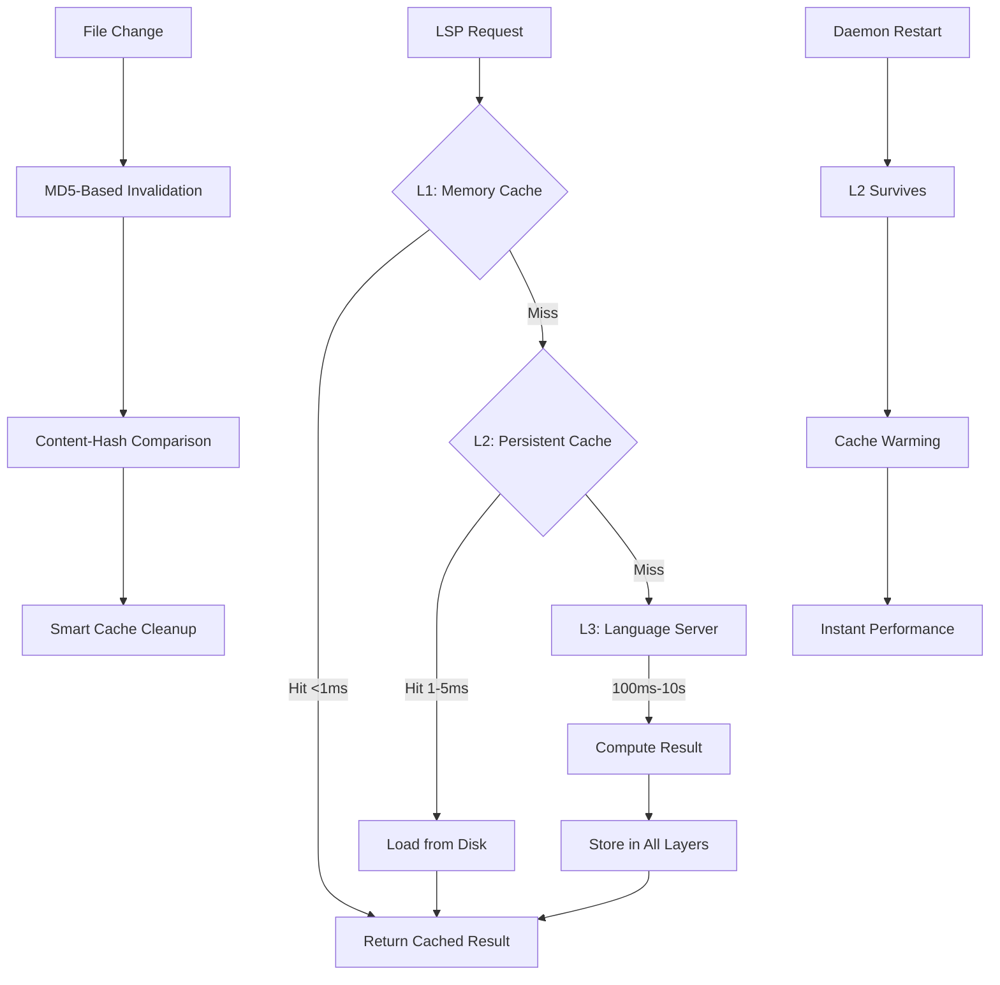
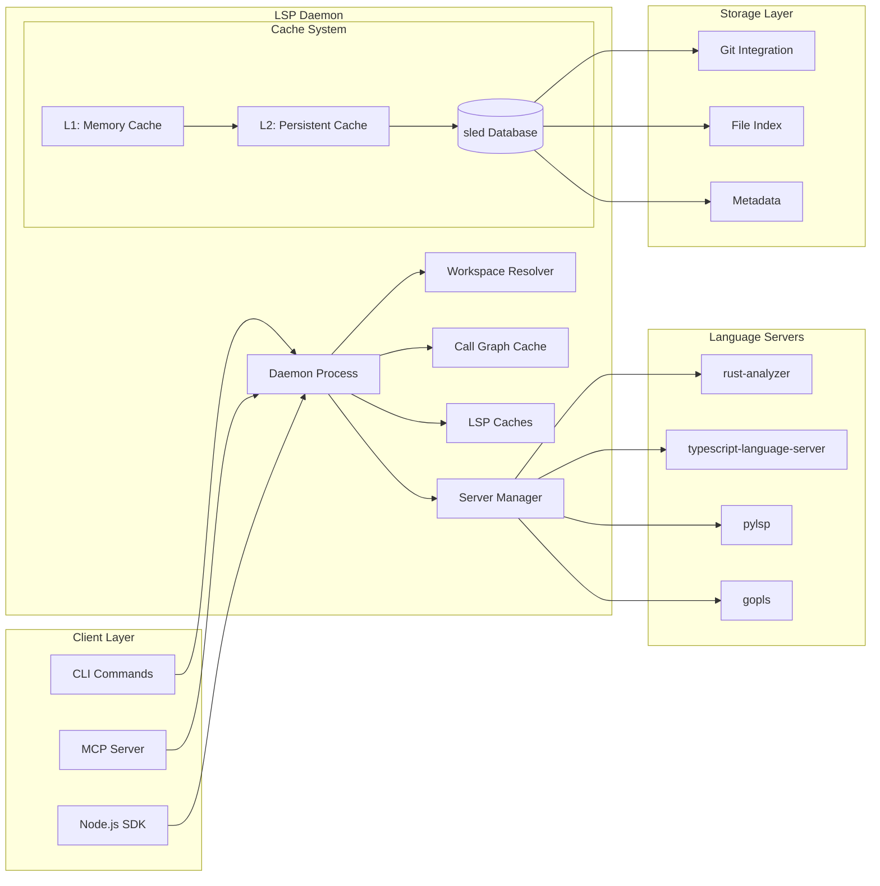

# LSP Indexing System Overview

Probe's LSP (Language Server Protocol) indexing system provides deep semantic understanding of code beyond simple text matching. By leveraging the same language servers that power modern IDEs, Probe can analyze call hierarchies, resolve definitions, find references, and provide rich contextual information about your codebase.

## What is LSP Indexing?

LSP indexing is Probe's integration with language servers that parse, analyze, and maintain semantic understanding of your code. Unlike traditional text-based search, LSP indexing provides:

- **Semantic Understanding**: Knows about functions, classes, variables, and their relationships
- **Cross-Reference Analysis**: Tracks where symbols are defined, used, and called
- **Call Hierarchy Mapping**: Shows the complete call graph for any function
- **Type Information**: Understands data types, method signatures, and interfaces
- **Workspace Awareness**: Maintains context across entire projects and dependencies

## Key Benefits

### 🚀 Enhanced Code Intelligence

```bash
# Traditional text search
probe search "calculate_total"

# LSP-enhanced extraction with call hierarchy
probe extract src/billing.rs#calculate_total --lsp
```

The LSP-enhanced version provides:
- All functions that call `calculate_total` (incoming calls)
- All functions that `calculate_total` calls (outgoing calls)
- Exact file locations and line numbers for easy navigation
- Type information and documentation

### ⚡ High-Performance Persistent Caching

The indexing system uses a revolutionary three-layer cache architecture:



#### Cache Layers
- **L1 Memory Cache**: Ultra-fast in-memory storage (<1ms access)
- **L2 Persistent Cache**: Survives restarts using sled database (1-5ms access)  
- **L3 LSP Servers**: Language server computation only on miss (100ms-10s)

#### Advanced Features
- **Content-Addressed Caching**: Only re-indexes when files actually change
- **MD5-Based Invalidation**: Perfect cache accuracy through content hashing
- **Persistent Storage**: Cache survives daemon restarts and system reboots
- **Universal Compatibility**: Works in CI, Docker, and non-git environments
- **Team Collaboration**: Import/export cache for instant project onboarding
- **Automatic Cleanup**: Configurable TTL and size-based eviction

### 🔄 Automatic Workspace Discovery

```bash
# Automatically detects and initializes workspaces
probe lsp init-workspaces ./my-project --recursive

# Returns initialized workspaces for each language:
# ✓ Rust: /my-project/backend (rust-analyzer)
# ✓ TypeScript: /my-project/frontend (typescript-language-server)
# ✓ Python: /my-project/scripts (pylsp)
```

## Core Concepts

### Language Servers

Probe integrates with industry-standard language servers:

| Language | Server | Features |
|----------|--------|----------|
| **Rust** | rust-analyzer | Advanced macro expansion, trait resolution |
| **TypeScript/JavaScript** | typescript-language-server | Module resolution, type checking |
| **Python** | Python LSP Server (pylsp) | Import analysis, type hints |
| **Go** | gopls | Package awareness, interface satisfaction |
| **Java** | Eclipse JDT | Classpath resolution, inheritance |
| **C/C++** | clangd | Header resolution, template instantiation |

### Workspace Management

Each workspace corresponds to a language project root:

```
my-project/
├── Cargo.toml          # Rust workspace
├── frontend/
│   └── package.json    # Node.js workspace  
└── scripts/
    └── pyproject.toml  # Python workspace
```

The daemon automatically:
1. **Discovers** project roots by looking for manifest files
2. **Initializes** appropriate language servers for each workspace
3. **Manages** server lifecycle and connection pooling
4. **Maintains** separate caches for each language/workspace combination

### Per-Workspace Cache System

Probe implements sophisticated per-workspace caching with intelligent cache routing:

**Workspace Cache Isolation:**
```
~/Library/Caches/probe/lsp/workspaces/
├── abc123_backend-api/          # Backend service cache
│   ├── call_graph.db
│   └── metadata.json
├── def456_frontend-app/         # Frontend app cache
│   ├── call_graph.db
│   └── metadata.json  
└── ghi789_shared-lib/          # Shared library cache
    ├── call_graph.db
    └── metadata.json
```

**Key Benefits:**
- **Cache Isolation**: Each project has its own cache, preventing cross-project pollution
- **Monorepo Support**: Nested workspaces (e.g., backend/, frontend/) get separate caches
- **Intelligent Routing**: Files automatically cache in their nearest workspace
- **LRU Management**: Least-used workspace caches evicted when memory limits reached
- **Team Collaboration**: Workspace-specific caches can be shared and backed up

### Content-Addressed Caching

Cache keys are based on file content, not timestamps:

```rust
CacheKey {
    file: "/src/calculator.rs",
    symbol: "calculate_total", 
    line: 42,
    column: 8,
    content_md5: "a1b2c3d4e5f6...", // File content hash
    operation: CallHierarchy
}
```

Benefits:
- **Universal Compatibility**: Works in any environment (CI, Docker, non-git directories)
- **Build System Safe**: Works with generated files and build artifacts  
- **Collaborative**: Team members share cache hits on identical code
- **Perfect Accuracy**: MD5 hashing ensures cache is always up-to-date
- **Efficient**: Only re-analyzes when code actually changes

## Architecture Overview



### Components

- **LSP Daemon**: Background service managing language servers and persistent caches
- **Server Manager**: Pools and lifecycle management for language server processes
- **Workspace Resolver**: Discovers and maps files to appropriate workspaces
- **Three-Layer Cache System**:
  - **L1 Memory Cache**: Ultra-fast in-memory storage with LRU eviction
  - **L2 Persistent Cache**: Disk-based sled database for restart persistence
  - **L3 Language Servers**: Computation layer with automatic caching
- **Storage Layer**:
  - **File Index**: Maps files to cache entries for invalidation
  - **Content Tracking**: MD5-based invalidation for perfect cache accuracy
  - **Metadata**: Performance stats, cleanup schedules, and cache health

## Getting Started

### Basic Usage

```bash
# Start using LSP features immediately
probe extract src/main.rs#main --lsp

# Check daemon status
probe lsp status

# View real-time logs
probe lsp logs --follow
```

### Daemon Management

```bash
# Manual daemon control (usually automatic)
probe lsp start           # Start daemon
probe lsp restart         # Restart daemon  
probe lsp shutdown        # Stop daemon

# Workspace initialization
probe lsp init-workspaces . --recursive
```

### Performance Optimization

```bash
# Pre-warm language servers for faster response
probe lsp init-workspaces ./my-project

# Enable persistent cache (survives daemon restarts)
export PROBE_LSP_PERSISTENCE_ENABLED=true
export PROBE_LSP_PERSISTENCE_PATH=~/.cache/probe/lsp/call_graph.db

# Configure cache settings - works everywhere, no git dependency
export PROBE_LSP_CACHE_SIZE_MB=512
export PROBE_LSP_CACHE_TTL_DAYS=30

# Enable debug logging
probe lsp start --log-level debug
```

## Use Cases

### 🔍 Code Exploration

Understand unfamiliar codebases quickly:

```bash
# Explore a function's context
probe extract src/auth/handler.rs#authenticate --lsp

# Output shows:
# - Who calls this function (callers)
# - What this function calls (callees)  
# - Type signatures and documentation
# - Exact file locations for navigation
```

### 🛠️ Refactoring Support

Identify impact before making changes:

```bash
# Find all callers before modifying an API
probe extract src/api/v1.rs#deprecated_endpoint --lsp | grep "Incoming"

# Shows all code that would break if you change this function
```

### 📊 Code Analysis

Generate insights about your codebase:

```bash
# Analyze test coverage
probe extract src/core.rs#critical_function --lsp | grep -E "(test_|spec_)"

# Find unused functions (no incoming calls)
probe extract src/utils.rs#helper_function --lsp | grep -c "Incoming: 0"
```

### 🤖 AI Integration

Enhanced context for AI coding assistants:

```bash
# Rich context for AI pair programming
probe extract src/complex_algorithm.rs#optimize_me --lsp --output json

# Provides AI with:
# - Function implementation
# - All dependencies (outgoing calls)
# - All usage sites (incoming calls)
# - Type information and documentation
```

## Next Steps

- **[Architecture Guide](./indexing-architecture.md)** - Deep dive into system internals
- **[Configuration Reference](./indexing-configuration.md)** - All settings and environment variables
- **[CLI Commands](./indexing-cli-reference.md)** - Complete command documentation
- **[Performance Guide](./indexing-performance.md)** - Optimization and tuning
- **[API Reference](./indexing-api-reference.md)** - Integration for developers

## Troubleshooting

### Common Issues

**No call hierarchy data returned**
- Ensure symbol is at function definition, not inside body
- Wait for initial language server indexing (10-30 seconds)
- Check `probe lsp logs` for errors

**Slow response times**
- Language server may still be indexing large codebase
- Consider pre-warming with `probe lsp init-workspaces`
- Check memory usage and adjust cache settings

**Connection errors**
- Daemon auto-starts on first use
- Check status with `probe lsp status`
- Restart daemon: `probe lsp restart`

For comprehensive troubleshooting, see the [Performance Guide](./indexing-performance.md#troubleshooting).