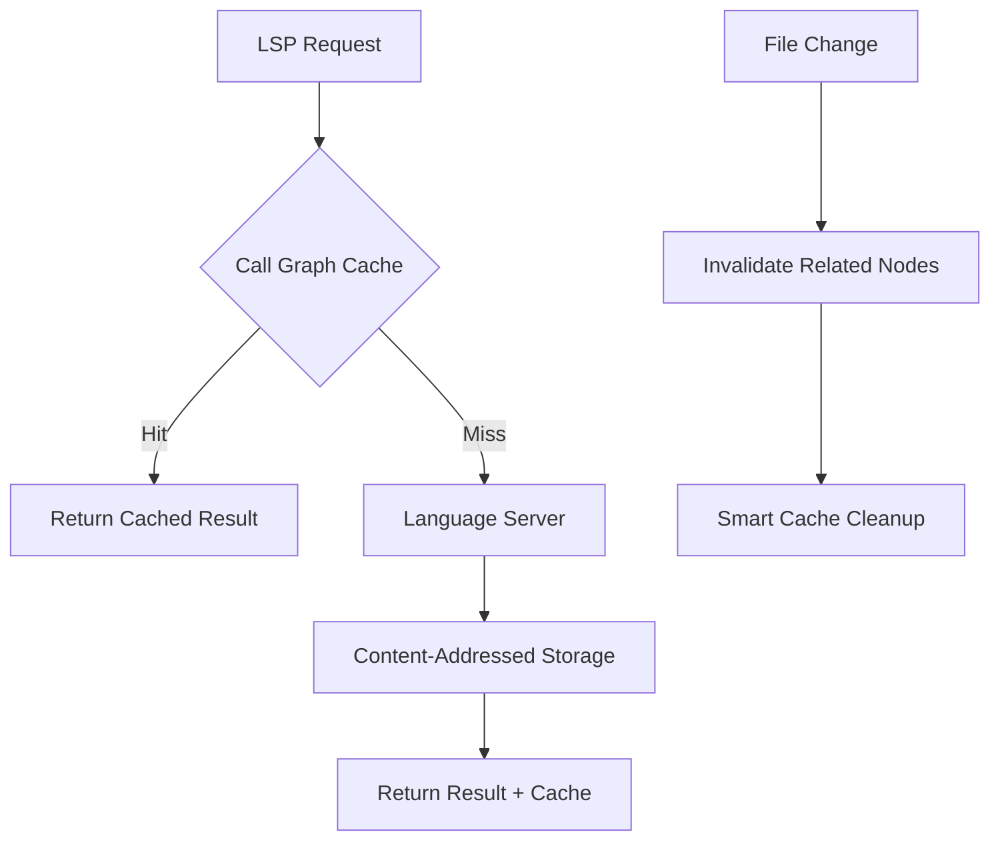
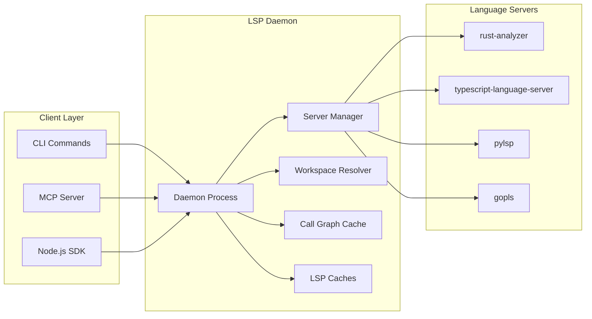

# LSP Indexing System Overview

Probe's LSP (Language Server Protocol) indexing system provides deep semantic understanding of code beyond simple text matching. By leveraging the same language servers that power modern IDEs, Probe can analyze call hierarchies, resolve definitions, find references, and provide rich contextual information about your codebase.

## What is LSP Indexing?

LSP indexing is Probe's integration with language servers that parse, analyze, and maintain semantic understanding of your code. Unlike traditional text-based search, LSP indexing provides:

- **Semantic Understanding**: Knows about functions, classes, variables, and their relationships
- **Cross-Reference Analysis**: Tracks where symbols are defined, used, and called
- **Call Hierarchy Mapping**: Shows the complete call graph for any function
- **Type Information**: Understands data types, method signatures, and interfaces
- **Workspace Awareness**: Maintains context across entire projects and dependencies

## Key Benefits

### 🚀 Enhanced Code Intelligence

```bash
# Traditional text search
probe search "calculate_total"

# LSP-enhanced extraction with call hierarchy
probe extract src/billing.rs#calculate_total --lsp
```

The LSP-enhanced version provides:
- All functions that call `calculate_total` (incoming calls)
- All functions that `calculate_total` calls (outgoing calls)
- Exact file locations and line numbers for easy navigation
- Type information and documentation

### ⚡ High-Performance Caching

The indexing system uses multiple cache layers:



- **Content-Addressed Caching**: Only re-indexes when files actually change
- **Graph-Aware Invalidation**: Efficiently updates related symbols when code changes
- **Multi-Level Storage**: In-memory + persistent disk caching options

### 🔄 Automatic Workspace Discovery

```bash
# Automatically detects and initializes workspaces
probe lsp init-workspaces ./my-project --recursive

# Returns initialized workspaces for each language:
# ✓ Rust: /my-project/backend (rust-analyzer)
# ✓ TypeScript: /my-project/frontend (typescript-language-server)
# ✓ Python: /my-project/scripts (pylsp)
```

## Core Concepts

### Language Servers

Probe integrates with industry-standard language servers:

| Language | Server | Features |
|----------|--------|----------|
| **Rust** | rust-analyzer | Advanced macro expansion, trait resolution |
| **TypeScript/JavaScript** | typescript-language-server | Module resolution, type checking |
| **Python** | Python LSP Server (pylsp) | Import analysis, type hints |
| **Go** | gopls | Package awareness, interface satisfaction |
| **Java** | Eclipse JDT | Classpath resolution, inheritance |
| **C/C++** | clangd | Header resolution, template instantiation |

### Workspace Management

Each workspace corresponds to a language project root:

```
my-project/
├── Cargo.toml          # Rust workspace
├── frontend/
│   └── package.json    # Node.js workspace  
└── scripts/
    └── pyproject.toml  # Python workspace
```

The daemon automatically:
1. **Discovers** project roots by looking for manifest files
2. **Initializes** appropriate language servers for each workspace
3. **Manages** server lifecycle and connection pooling
4. **Maintains** separate caches for each language/workspace combination

### Content-Addressed Caching

Cache keys are based on file content, not timestamps:

```rust
CacheKey {
    file: "/src/calculator.rs",
    symbol: "calculate_total", 
    line: 42,
    column: 8,
    content_md5: "a1b2c3d4e5f6...", // File content hash
    operation: CallHierarchy
}
```

Benefits:
- **Version Control Friendly**: Cache survives git operations
- **Build System Safe**: Works with generated files and build artifacts  
- **Collaborative**: Team members share cache hits on identical code
- **Efficient**: Only re-analyzes when code actually changes

## Architecture Overview



### Components

- **LSP Daemon**: Background service managing language servers and caches
- **Server Manager**: Pools and lifecycle management for language server processes
- **Workspace Resolver**: Discovers and maps files to appropriate workspaces
- **Call Graph Cache**: High-performance caching layer with graph-aware invalidation
- **LSP Caches**: Operation-specific caches (definitions, references, hover, etc.)

## Getting Started

### Basic Usage

```bash
# Start using LSP features immediately
probe extract src/main.rs#main --lsp

# Check daemon status
probe lsp status

# View real-time logs
probe lsp logs --follow
```

### Daemon Management

```bash
# Manual daemon control (usually automatic)
probe lsp start           # Start daemon
probe lsp restart         # Restart daemon  
probe lsp shutdown        # Stop daemon

# Workspace initialization
probe lsp init-workspaces . --recursive
```

### Performance Optimization

```bash
# Pre-warm language servers for faster response
probe lsp init-workspaces ./my-project

# Configure cache settings
export PROBE_LSP_CACHE_SIZE=1000
export PROBE_LSP_TTL=3600

# Enable debug logging
probe lsp start --log-level debug
```

## Use Cases

### 🔍 Code Exploration

Understand unfamiliar codebases quickly:

```bash
# Explore a function's context
probe extract src/auth/handler.rs#authenticate --lsp

# Output shows:
# - Who calls this function (callers)
# - What this function calls (callees)  
# - Type signatures and documentation
# - Exact file locations for navigation
```

### 🛠️ Refactoring Support

Identify impact before making changes:

```bash
# Find all callers before modifying an API
probe extract src/api/v1.rs#deprecated_endpoint --lsp | grep "Incoming"

# Shows all code that would break if you change this function
```

### 📊 Code Analysis

Generate insights about your codebase:

```bash
# Analyze test coverage
probe extract src/core.rs#critical_function --lsp | grep -E "(test_|spec_)"

# Find unused functions (no incoming calls)
probe extract src/utils.rs#helper_function --lsp | grep -c "Incoming: 0"
```

### 🤖 AI Integration

Enhanced context for AI coding assistants:

```bash
# Rich context for AI pair programming
probe extract src/complex_algorithm.rs#optimize_me --lsp --output json

# Provides AI with:
# - Function implementation
# - All dependencies (outgoing calls)
# - All usage sites (incoming calls)
# - Type information and documentation
```

## Next Steps

- **[Architecture Guide](./indexing-architecture.md)** - Deep dive into system internals
- **[Configuration Reference](./indexing-configuration.md)** - All settings and environment variables
- **[CLI Commands](./indexing-cli-reference.md)** - Complete command documentation
- **[Performance Guide](./indexing-performance.md)** - Optimization and tuning
- **[API Reference](./indexing-api-reference.md)** - Integration for developers

## Troubleshooting

### Common Issues

**No call hierarchy data returned**
- Ensure symbol is at function definition, not inside body
- Wait for initial language server indexing (10-30 seconds)
- Check `probe lsp logs` for errors

**Slow response times**
- Language server may still be indexing large codebase
- Consider pre-warming with `probe lsp init-workspaces`
- Check memory usage and adjust cache settings

**Connection errors**
- Daemon auto-starts on first use
- Check status with `probe lsp status`
- Restart daemon: `probe lsp restart`

For comprehensive troubleshooting, see the [Performance Guide](./indexing-performance.md#troubleshooting).