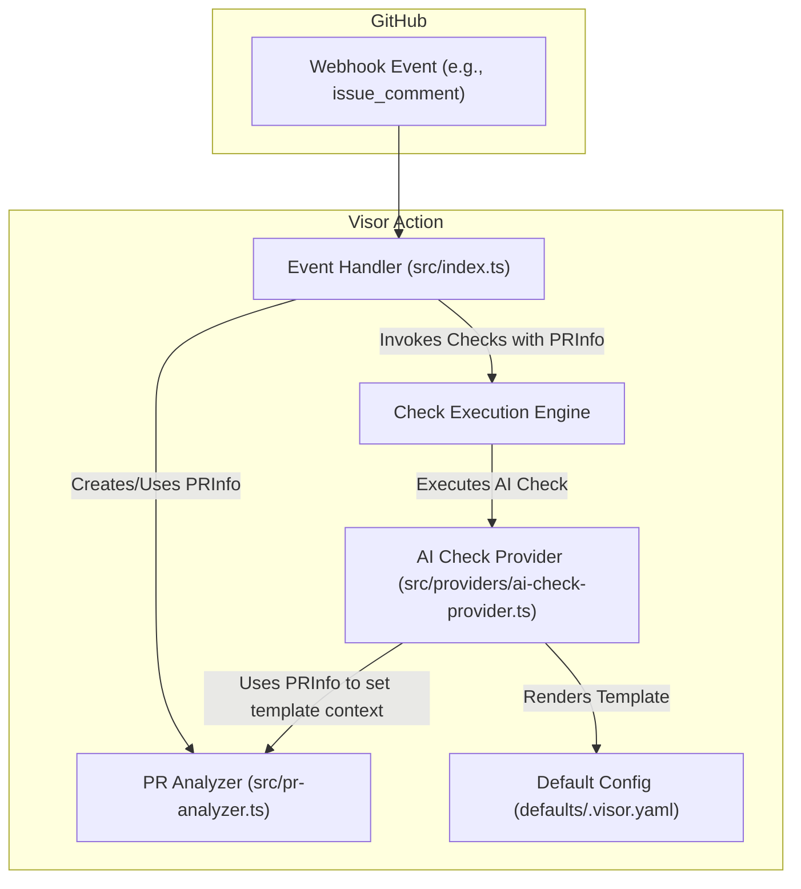

# Test Mermaid Auto-Fixing

This demonstrates the enhanced mermaid auto-fixing logic that now proactively quotes node labels containing special characters.

## Original Problematic Diagram

```mermaid
graph TD
    subgraph GitHub
        A[Webhook Event (e.g., issue_comment)]
    end

    subgraph Visor Action
        B[Event Handler (src/index.ts)]
        C[PR Analyzer (src/pr-analyzer.ts)]
        D[Check Execution Engine]
        E[AI Check Provider (src/providers/ai-check-provider.ts)]
        F[Default Config (defaults/.visor.yaml)]
    end

    A --> B
    B -- "Creates/Uses PRInfo" --> C
    B -- "Invokes Checks with PRInfo" --> D
    D -- "Executes AI Check" --> E
    E -- "Uses PRInfo to set template context" --> C
    E -- "Renders Template" --> F
```

## Expected Auto-Fixed Result

The enhanced auto-fixing logic should automatically transform this to:



## What Gets Fixed

The enhanced logic detects and quotes:

1. **Parentheses**: `(e.g., issue_comment)` → `"(e.g., issue_comment)"`
2. **File paths**: `(src/index.ts)` → `"(src/index.ts)"`
3. **File extensions**: `.ts`, `.yaml` etc.
4. **Special phrases**: `e.g.`, `i.e.`
5. **Special characters**: `/`, `:`, `;`, etc.

This prevents GitHub's mermaid parser from throwing "got 'PS'" errors and makes diagrams render correctly.