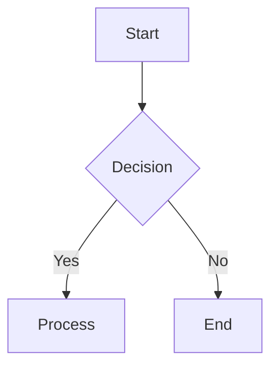

# Web Interface Changes Plan

## Overview
Convert the folder selection mechanism from an interactive file picker to an environment variable-based configuration.

## Latest Change: Mermaid Diagram Support

### Overview
Added support for rendering Mermaid diagrams in the chat interface, allowing Claude to generate and display visual diagrams for code explanations.

### Changes Made
1. Added Mermaid.js library via CDN
2. Modified Marked.js configuration to handle Mermaid code blocks
3. Added initialization and rendering logic for Mermaid diagrams
4. Added CSS styling for diagram display
5. Updated the "About Probe Tool" section to include diagram examples

### Usage
Claude can now generate diagrams by including Mermaid syntax in code blocks with the 'mermaid' language specifier:



### Benefits
- Improved visualization of code architecture and flows
- Better explanation of complex relationships between components
- Enhanced understanding of system design through visual representation

## Environment Variables
Add to `.env`:
```
ALLOWED_FOLDERS=/path/to/folder1,/path/to/folder2,/path/to/folder3
```

## Changes Required

### 1. Server Changes (main.js)
- Add parsing of `ALLOWED_FOLDERS` environment variable
- Validate folder paths on startup
- Send allowed folders to client on initial page load
- Use allowed folders for context in chat requests

Example implementation:
```javascript
const allowedFolders = process.env.ALLOWED_FOLDERS?.split(',').filter(Boolean) || [];
// Validate folders exist on startup
for (const folder of allowedFolders) {
  if (!existsSync(folder)) {
    console.error(`Warning: Folder ${folder} does not exist`);
  }
}
```

### 2. HTML/UI Changes (index.html)
- Remove file picker UI components
- Add read-only folder display section
- Update styling for static folder display

### 3. Security Considerations
- Validate all folder paths on server startup
- Only allow access to predefined folders
- Sanitize folder paths before use
- Log invalid folder access attempts

## Migration Guide
1. Set up ALLOWED_FOLDERS in .env
2. Restart server to apply changes
3. Verify folders are displayed correctly
4. Test chat functionality with new context system

## Testing Checklist
- [ ] Server correctly loads ALLOWED_FOLDERS
- [ ] Invalid folders are logged on startup
- [ ] UI displays allowed folders
- [ ] Chat context includes allowed folders
- [ ] Security validations work as expected